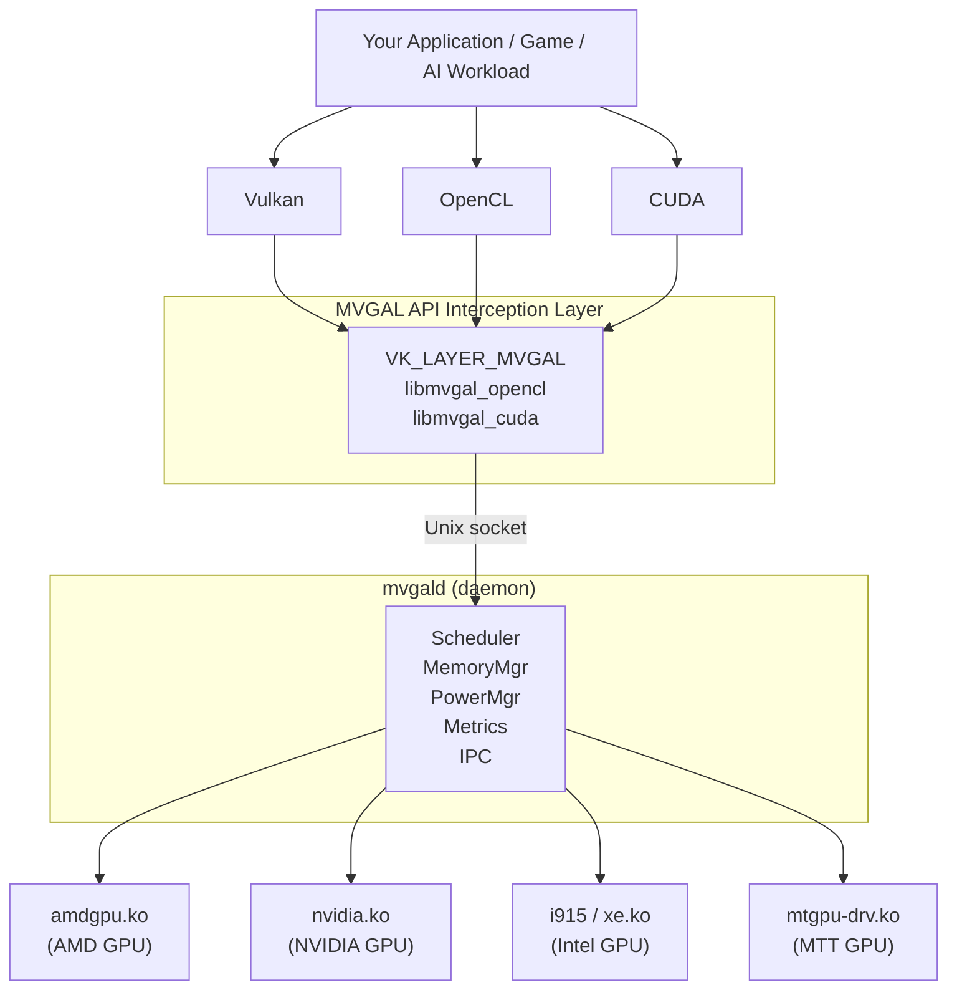

# mvgal-docs

Documentation for **MVGAL** — Multi-Vendor GPU Aggregation Layer for Linux.

> **v0.7.8** — Multi-vendor OpenCL ICD aggregation, unified VRAM heap, PCIe P2P, AI scheduler, Proton bridge, Secure Boot MOK enrollment, hardened daemon.

## 📚 Documentation

- **HTML site** — [Open the full documentation site](https://thecreategm.github.io/mvgal-docs/site/index.html) (self-contained, works on GitHub Pages / Gitea Pages)
- **Markdown source** — [`docs/`](docs/) contains the raw documentation files
- **Quick Start** — [`docs/QUICKSTART.md`](docs/QUICKSTART.md)
- **Installation** — [`docs/INSTALL.md`](docs/INSTALL.md)
- **Architecture** — [`docs/ARCHITECTURE.md`](docs/ARCHITECTURE.md)
- **API Reference** — [`docs/API.md`](docs/API.md)
- **Scheduling Strategies** — [`docs/STRATEGIES.md`](docs/STRATEGIES.md)
- **Memory Management** — [`docs/MEMORY.md`](docs/MEMORY.md)
- **Hardware Compatibility** — [`docs/HARDWARE_COMPATIBILITY.md`](docs/HARDWARE_COMPATIBILITY.md)
- **Steam / Proton** — [`docs/STEAM_INTEGRATION.md`](docs/STEAM_INTEGRATION.md)
- **Power Management** — [`docs/POWER_MANAGEMENT.md`](docs/POWER_MANAGEMENT.md)
- **Troubleshooting** — [`docs/TROUBLESHOOTING.md`](docs/TROUBLESHOOTING.md)
- **Project Status** — [`docs/STATUS.md`](docs/STATUS.md)
- **Changelog** — [`docs/CHANGELOG.md`](docs/CHANGELOG.md)
- **Secure Boot / MOK** — [`docs/SECURE_BOOT.md`](docs/SECURE_BOOT.md)

## What is MVGAL?

Most Linux systems with multiple GPUs (e.g. an AMD RX 7900 + NVIDIA RTX 4080) treat each card as a completely separate device. Applications can only use one at a time, leaving the other idle.

MVGAL solves this by aggregating all available GPUs — regardless of vendor — into a single logical device. Any application, game, or compute workload can use it without modification.



## Features

- **Heterogeneous multi-GPU** — AMD, NVIDIA, Intel, and Moore Threads GPUs in any combination
- **Transparent interception** — Vulkan layer, OpenCL ICD, CUDA shim; no application changes needed
- **10 scheduling strategies** — Round-robin, Least-Load, Priority, Affinity, Bin-Packing, GPU-Aware, Hybrid, RLD, REP, PPL
- **Unified memory manager** — DMA-BUF zero-copy, PCIe P2P, host-RAM staging fallback
- **GPU health monitoring** — Temperature, utilization, VRAM pressure with configurable thresholds
- **Steam/Proton integration** — Frame pacing, AFR for games, DXVK and VKD3D-Proton compatible
- **Power management** — Idle detection, GPU parking, dynamic frequency scaling
- **Memory-safe subsystems** — Fence manager, memory tracker, capability model written in Rust
- **Qt dashboard + REST API** — Real-time monitoring, scheduler control, log viewer
- **Secure Boot support** — Kernel modules signed at install time; per-machine MOK enrollment via `mvgal-enroll-mok`
- **Hardened daemon** — Drops capabilities after init, prunes bounding set, restricted D-Bus policy
- **Degraded-mode reporting** — Clear warnings when the kernel module is not loaded (e.g. MOK not enrolled)

## Supported Hardware

| Vendor | Architectures | Driver |
|--------|--------------|--------|
| **AMD** | RDNA 1/2/3, GCN, APU (Vega/RDNA) | `amdgpu` |
| **NVIDIA** | Turing (RTX 20xx), Ampere (RTX 30xx), Ada (RTX 40xx), Pascal | `nvidia-open` / proprietary |
| **Intel** | Gen 9–12 (iGPU), Xe / Arc (discrete) | `i915` / `xe` |
| **Moore Threads** | MTT S60, S80, S2000 | `mtgpu-drv` |

## Install from COPR (no build needed)

MVGAL is available as a pre-built package via Fedora COPR. No need to compile from source.

```bash
sudo dnf copr enable axogm/mvgal
sudo dnf install mvgal
```

Supported targets: Fedora 40+ · RHEL/AlmaLinux/Rocky 9 & 10 · CentOS Stream 9 & 10 · openSUSE Tumbleweed · Amazon Linux 2023

## Quick Start

```bash
# Start the daemon
pkexec systemctl start mvgald
pkexec systemctl enable mvgald   # start on boot

# Verify
mvgal-info          # list detected GPUs
mvgal-status        # real-time utilization
mvgal-compat --system   # check readiness
```

## What's New in v0.7.8

- **Secure Boot hardening** — DKMS modules are signed with a per-machine MVGAL key and `mvgal-enroll-mok` verifies enrollment via `mokutil --list-new` (no more false success).
- **Daemon capability dropping** — `mvgald` clears its capability sets after init and prunes the bounding set to `CAP_SYS_ADMIN CAP_DAC_OVERRIDE CAP_SYS_RAWIO`.
- **Restricted D-Bus policy** — `org.mvgal.MVGAL` is now limited to root and the `mvgal` group.
- **Real Vulkan driver version** — the ICD reports `apiVersion`/`driverVersion` from the MVGAL version macros instead of `0.0.0`.
- **Degraded-mode reporting** — `mvgal-status` prints `Kernel Module: NOT LOADED (degraded userspace-only mode)` with a MOK hint and a real load-balance estimate.
- **Vulkan ICD fixes** — WSI entry points (v0.7.5), device dispatch for `vkCreateImage` (v0.7.7), and queue-family overflow fix (v0.7.7).

See [`docs/CHANGELOG.md`](docs/CHANGELOG.md) for the full history and [`docs/SECURE_BOOT.md`](docs/SECURE_BOOT.md) for MOK enrollment.

## CLI Tools

| Tool | Description |
|------|-------------|
| `mvgal` | Main CLI: start/stop daemon, set strategy, show stats |
| `mvgal-info` | Print all detected GPUs, VRAM, temperature, utilization |
| `mvgal-status` | Real-time GPU utilization/VRAM bars; `--watch` for continuous refresh; degraded-mode warnings |
| `mvgal-bench` | Memory bandwidth, compute FLOPS, scheduling latency |
| `mvgal-compat` | System readiness check + per-app compatibility database |
| `mvgal-config` | Configure scheduler mode, idle thresholds, GPU enable/disable |
| `mvgal-probe` | PCI topology + kernel UAPI probe (`/dev/mvgal0` ioctls) |
| `mvgal-enum` | Enumerate GPUs and capabilities |
| `mvgal-hw-validate` | Hardware validation with actionable failure hints |
| `mvgal-steam-setup` | Steam/Proton integration helper |
| `mvgal-enroll-mok` | Enroll the MVGAL signing key for Secure Boot (MOK) |

## Scheduling Strategies

| Strategy | Best For |
|----------|----------|
| Round-Robin (RR) | Even distribution, general compute |
| Least-Load (LL) | Route work to the least-busy GPU |
| Priority (PRI) | High-priority work to fastest device |
| Affinity (AFF) | Pin workloads to specific GPUs |
| Bin-Packing (BP) | Fill GPUs to capacity before next |
| GPU-Aware (GA) | Match workload to GPU capabilities |
| Hybrid (HYB) | Automatic selection based on workload metrics |
| RLD — Render Layer Distribution | Multi-GPU VR — split eye renders |
| REP — Replication Mode | ML training (data-parallel) — identical model per GPU |
| PPL — Pipeline Parallelism | Video transcoding — stream through pipeline |

See [`docs/STRATEGIES.md`](docs/STRATEGIES.md) for full details.

## Steam / Proton Integration

Add to Steam launch options:
```
ENABLE_MVGAL=1 MVGAL_STRATEGY=afr %command%
```

| Variable | Values | Description |
|----------|--------|-------------|
| `ENABLE_MVGAL` | `0` / `1` | Enable MVGAL for this launch |
| `MVGAL_STRATEGY` | `afr`, `sfr`, `hybrid`, `single` | Scheduling strategy |
| `MVGAL_FRAME_PACING` | `0` / `1` | Enable vsync-aligned frame pacing |
| `MVGAL_GPU_MASK` | hex bitmask | Which GPUs to use (e.g. `0x3` = GPU 0+1) |

## Memory Management

MVGAL uses a three-tier transfer strategy:

1. **DMA-BUF zero-copy** (preferred — kernel-supported, all vendors)
2. **PCIe P2P transfer** (fallback — requires same root complex)
3. **Host-RAM staging** (last resort — always works, highest latency)

## License

- **Kernel module**: GPL-2.0-only
- **Userspace components**: GPL-3.0-only
- **Rust crates**: MIT OR Apache-2.0

## Source Code

The MVGAL source code is available for purchase at:

- **Patreon Shop** — [patreon.com/axogm/shop](https://www.patreon.com/axogm/shop)
- **Ko-fi Shop** — [ko-fi.com/axogm/shop](https://ko-fi.com/axogm/shop)

Your purchase helps fund continued development of MVGAL and other open-source projects.

## Getting Help

- **Issues & bugs** — [github.com/TheCreateGM/mvgal-docs/issues](https://github.com/TheCreateGM/mvgal-docs/issues)
- **Suggestions & improvements** — [github.com/TheCreateGM/mvgal-docs/discussions](https://github.com/TheCreateGM/mvgal-docs/discussions)
