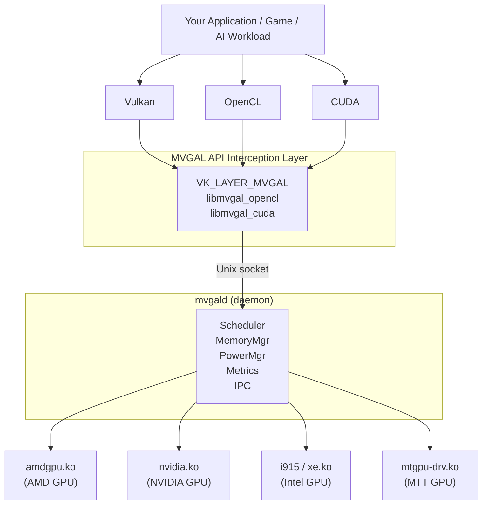

# mvgal-docs

Documentation for **MVGAL** — Multi-Vendor GPU Aggregation Layer for Linux.

> **Source version 0.7.14** (CMake/Cargo metadata); the source changelog documents releases through **0.7.14**. This project has API and integration work in progress. Discovery or an API symbol does not mean cross-vendor submission or VRAM allocation is supported.

## 📚 Documentation

- **HTML site** — [Open the full documentation site](https://thecreategm.github.io/mvgal-docs/site/index.html) (self-contained, works on GitHub Pages / Gitea Pages)
- **Markdown source** — [`docs/`](docs/) contains the raw documentation files
- **Quick Start** — [`docs/QUICKSTART.md`](docs/QUICKSTART.md)
- **Installation** — [`docs/INSTALL.md`](docs/INSTALL.md)
- **Architecture** — [`docs/ARCHITECTURE.md`](docs/ARCHITECTURE.md)
- **API Reference** — [`docs/API.md`](docs/API.md)
- **Scheduling Strategies** — [`docs/STRATEGIES.md`](docs/STRATEGIES.md)
- **Memory Management** — [`docs/MEMORY.md`](docs/MEMORY.md)
- **Hardware Compatibility** — [`docs/HARDWARE_COMPATIBILITY.md`](docs/HARDWARE_COMPATIBILITY.md)
- **Steam / Proton** — [`docs/STEAM_INTEGRATION.md`](docs/STEAM_INTEGRATION.md)
- **Power Management** — [`docs/POWER_MANAGEMENT.md`](docs/POWER_MANAGEMENT.md)
- **Troubleshooting** — [`docs/TROUBLESHOOTING.md`](docs/TROUBLESHOOTING.md)
- **Project Status** — [`docs/STATUS.md`](docs/STATUS.md)
- **Changelog** — [`docs/CHANGELOG.md`](docs/CHANGELOG.md)
- **Secure Boot / MOK** — [`docs/SECURE_BOOT.md`](docs/SECURE_BOOT.md)

## What is MVGAL?

Most Linux systems with multiple GPUs (e.g. an AMD RX 7900 + NVIDIA RTX 4080) treat each card as a completely separate device. Applications can only use one at a time, leaving the other idle.

MVGAL explores cross-vendor GPU discovery, runtime interfaces, scheduling, and application integration on Linux. The kernel module discovers GPUs without binding them away from their native drivers. As of 0.7.14, unsupported kernel submission and VRAM allocation return `-EOPNOTSUPP`; the Vulkan ICD does not advertise a synthetic aggregate device. Verify each API path on the target system before relying on it.



## Features

- **GPU discovery** — runtime capability probing across supported vendor drivers
- **Userspace interfaces** — Vulkan, OpenCL, and CUDA interposition components (build and execution support varies by path)
- **Scheduling APIs** — strategy identifiers are exposed, while actual dispatch depends on verified vendor capabilities
- **Memory APIs** — DMA-BUF and P2P interfaces; unsupported allocation paths fail explicitly
- **GPU health monitoring** — Temperature, utilization, VRAM pressure with configurable thresholds
- **Steam/Proton integration** — compatibility helpers; game support depends on the driver and selected API path
- **Power management** — telemetry and controls where a probed vendor capability exists
- **Memory-safe subsystems** — Fence manager, memory tracker, capability model written in Rust
- **Qt dashboard** — optional UI target (`MVGAL_BUILD_UI`, **OFF by default**); the current CMake tree does not define a REST service
- **Secure Boot support** — Kernel modules signed at install time; per-machine MOK enrollment via `mvgal-enroll-mok`
- **Hardened daemon** — Drops capabilities after init, prunes bounding set, restricted D-Bus policy
- **Degraded-mode reporting** — Clear warnings when the kernel module is not loaded (e.g. MOK not enrolled)

## Supported Hardware

| Vendor | Architectures | Driver |
|--------|--------------|--------|
| **AMD** | RDNA 1/2/3, GCN, APU (Vega/RDNA) | `amdgpu` |
| **NVIDIA** | Turing (RTX 20xx), Ampere (RTX 30xx), Ada (RTX 40xx), Pascal | `nvidia-open` / proprietary |
| **Intel** | Gen 9–12 (iGPU), Xe / Arc (discrete) | `i915` / `xe` |
| **Moore Threads** | MTT S60, S80, S2000 | `mtgpu-drv` |

## Packages

This workspace includes package artifacts under [`package/`](package/README.md), which currently holds **0.7.14 RPMs** and 0.7.13 builds in the other formats — check the version before installing. The source tree includes RPM, Debian, Flatpak, and other packaging definitions. Availability of a remote COPR repository depends on the current publication state; check that repository before installation.

```bash
dnf info mvgal
# Install using the package manager and repository configured for your distribution
```

Packaging configurations are not a guarantee that every target is currently published or runtime validated.

## Quick Start

```bash
# Start the daemon. The installed unit is mvgal-daemon.service; the RPM's
# %post runs `systemctl enable`, which also creates the mvgald.service and
# mvgal.service aliases, so the short names work after installation.
pkexec systemctl start mvgal-daemon
pkexec systemctl enable mvgal-daemon   # start on boot

# Verify
mvgal-info          # list detected GPUs
mvgal-status        # real-time utilization
mvgal-compat --system   # check readiness
```

## Recent source changes (through v0.7.14)

- **Secure Boot hardening** — DKMS modules are signed with a per-machine MVGAL key and `mvgal-enroll-mok` verifies enrollment via `mokutil --list-new` (no more false success).
- **Daemon capability dropping** — `mvgald` clears its capability sets after init and prunes the bounding set to `CAP_SYS_ADMIN CAP_DAC_OVERRIDE CAP_SYS_RAWIO CAP_SYS_MODULE`. `CAP_SYS_MODULE` was added in 0.7.14: without it the unit's `ExecStartPre` `modprobe` could never succeed.
- **Restricted D-Bus policy** — `org.mvgal.MVGAL` is now limited to root and the `mvgal` group. The shipped `com.mvgal.policy` declares exactly two actions, both `auth_admin`.
- **Real Vulkan driver version** — the ICD reports `apiVersion`/`driverVersion` from the MVGAL version macros instead of `0.0.0`.
- **Degraded-mode reporting** — `mvgal-status` prints `Kernel Module: NOT LOADED (degraded userspace-only mode)` with a MOK hint and a real load-balance estimate.
- **Shared module inventory** — one list (`/usr/lib/mvgal/modules.sh`) is now sourced by `mvgal-load`, `mvgal-unload`, and the privileged helper, so the three can no longer disagree about which modules exist.
- **OpenCL ICD no longer registered by default** — the `%post` scriptlet parks `mvgal.icd` when no other ICD is present, because a loader that finds only MVGAL raises a conformancy error.
- **Capability truthfulness** — v0.7.10–v0.7.14 removed synthetic devices, fabricated allocation/submission success, and unverified vendor capability claims. See the source changelog for details.

See [`docs/CHANGELOG.md`](docs/CHANGELOG.md) for the full history and [`docs/SECURE_BOOT.md`](docs/SECURE_BOOT.md) for MOK enrollment.

## CLI Tools

| Tool | Description |
|------|-------------|
| `mvgal` | Main CLI: start/stop daemon, set strategy, show stats |
| `mvgal-info` | Print all detected GPUs, VRAM, temperature, utilization (`--json`, `--count`, `--vulkan-groups`) |
| `mvgal-status` | Real-time GPU utilization/VRAM bars; `--watch` for continuous refresh; degraded-mode warnings |
| `mvgal-bench` | Memory bandwidth, compute FLOPS, scheduling latency |
| `mvgal-compat` | System readiness check + per-app compatibility database |
| `mvgal-config` | Configure scheduler mode, idle thresholds, GPU enable/disable |
| `mvgal-probe` | PCI topology + kernel UAPI probe (`/dev/mvgal0` ioctls) |
| `mvgal-enum` | Enumerate GPUs and capabilities |
| `mvgal-hw-validate` | Hardware validation with actionable failure hints |
| `mvgal-steam-setup` | Steam/Proton integration helper (`--list`, `--add`, `--remove`, `--check`, `--auto`) |
| `mvgal-load` | Privileged module loader; sources `/usr/lib/mvgal/modules.sh` |
| `mvgal-unload` | Privileged module unloader; same shared inventory |
| `mvgal-enroll-mok` | Enroll the MVGAL signing key for Secure Boot (MOK) |
| `mvgal-dmabuf-matrix` | Cross-vendor DMA-BUF import/export matrix probe |

## Scheduling Strategy Identifiers

| Identifier | Header description |
|------------|-------------------|
| `MVGAL_STRATEGY_ROUND_ROBIN` | Round-robin distribution |
| `MVGAL_STRATEGY_AFR` | Alternate Frame Rendering |
| `MVGAL_STRATEGY_SFR` | Split Frame Rendering |
| `MVGAL_STRATEGY_AUTO` | Auto-detect best strategy |
| `MVGAL_STRATEGY_COMPUTE_OFFLOAD` | Compute offloading |
| `MVGAL_STRATEGY_HYBRID` | Hybrid adaptive strategy |
| `MVGAL_STRATEGY_SINGLE_GPU` | Use single fastest GPU |
| `MVGAL_STRATEGY_TASK` | Task-based distribution |
| `MVGAL_STRATEGY_AI_DRIVEN` | AI/ML-driven scheduling strategy |
| `MVGAL_STRATEGY_RLD` | Radeon LD wrapper strategy |
| `MVGAL_STRATEGY_REP` | Reproducible build strategy |
| `MVGAL_STRATEGY_PPL` | AMD Performance Primitives strategy |
| `MVGAL_STRATEGY_CUSTOM` | Custom strategy (user-defined) |

These enum values are API/configuration identifiers; execution support depends on the backend and probed capabilities. See [`docs/STRATEGIES.md`](docs/STRATEGIES.md).

## Steam / Proton Integration

Use the Steam helper and consult its `--help` output for options supported by the installed build. Environment variables differ by integration path; do not assume a variable enables a capability that the runtime has not probed.

| Variable | Values | Consumed by | Description |
|----------|--------|-------------|-------------|
| `MVGAL_ENABLED` | `0` / `1` | written by the launch path | Master switch in the generated launch string |
| `MVGAL_VULKAN_ENABLE` | `0` / `1` | **Vulkan loader** (not `getenv`) | Enables the interception layer via the manifest's `enable_environment` |
| `MVGAL_VULKAN_DISABLE` | any | **Vulkan loader** (not `getenv`) | Disables the layer even if the app enabled it |
| `MVGAL_STRATEGY` | strategy name | execution layer | Scheduling strategy (see the table above) |
| `MVGAL_VULKAN_DEBUG` | any | `vk_layer.c:131` | Layer debug output |
| `MVGAL_FRAME_PACING_DEBUG` | any | `mvgal_frame_pacer.c:156` | Frame-pacer debug output |

> **Note** — `MVGAL_VULKAN_ENABLE` and `MVGAL_VULKAN_DISABLE` have **no `getenv` reader anywhere in the tree**. They are honoured by the Vulkan loader because `manifest.json.in` lists them under `enable_environment` / `disable_environment`. Setting them in a Steam launch option works; expecting library code to read them does not.
>
> **Warning** — `MVGAL_FRAME_PACING`, `MVGAL_GPU_MASK`, and `MVGAL_LOG_PATH` are **not read** by any MVGAL code. The GPU selection variable is `MVGAL_GPUS`, and frame pacing is not wired to a presentation hook (see [`docs/STEAM_INTEGRATION.md`](docs/STEAM_INTEGRATION.md) §4).

## Memory Management

The project contains interfaces for a three-tier transfer strategy. The kernel and userspace sides use different signals and even disagree on the ordering, so treat this as a description of the two independent selectors rather than one ranked list:

- **Kernel side** (`kernel/mvgal_memory.c`) — same `numa_node` → `MVGAL_MIGRATION_P2P`; both peers expose `export_dmabuf`/`import_dmabuf` → `DMA_BUF_ZERO_COPY`; otherwise → `HOST_STAGING`.
- **Userspace side** (`src/userspace/memory/memory.c`) — same source and destination → `COPY_P2P`; cross-vendor support confirmed → delegate to `mvgal_p2p_get_optimal_method()`; same PCIe root and same vendor → `COPY_P2P`; same root, different vendors → `COPY_DMA_BUF`; different roots → `COPY_CPU`.

Availability is capability-dependent and the source currently does not claim universal cross-vendor operation. See [`docs/MEMORY.md`](docs/MEMORY.md).

## License

MVGAL is multi-licensed by component. The authoritative statement is the [`LICENSE`](https://github.com/TheCreateGM/mvgal/blob/main/LICENSE) file in the source repository.

- **Kernel module** (`kernel/`): GPL-2.0-only — the `.ko` files declare `MODULE_LICENSE("GPL")`
- **Userspace components** (`src/`, `runtime/`, `include/`): GPL-3.0-only
- **Rust crates** (`safe/`, `bindings/rust/`): MIT OR Apache-2.0
- **Vendored Rust dependencies** (`vendor/`): each retains its own license

> **Note** — the RPM spec's `License:` field is `GPL-3.0-only` for the whole package, while the kernel modules inside it declare `MODULE_LICENSE("GPL")` (GPL-2.0-only) and one file, `kernel/vendors/mvgal_adreno.c`, declares the non-standard string `"GPL v2"`. That is a discrepancy in the source packaging metadata, not a documentation claim, and it is worth resolving upstream.

## Source Code

The MVGAL source is public: <https://github.com/TheCreateGM/mvgal>

Supporting continued development:

- **Patreon** — [patreon.com/axogm/shop](https://www.patreon.com/axogm/shop)
- **Ko-fi** — [ko-fi.com/axogm/shop](https://ko-fi.com/axogm/shop)

## Getting Help

- **Issues & bugs** — [github.com/TheCreateGM/mvgal-docs/issues](https://github.com/TheCreateGM/mvgal-docs/issues)
- **Suggestions & improvements** — [github.com/TheCreateGM/mvgal-docs/discussions](https://github.com/TheCreateGM/mvgal-docs/discussions)
