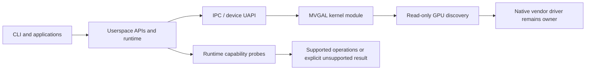

# MVGAL Architecture

> Source metadata is **0.7.14**; the source changelog documents releases through **0.7.14**. This page follows the current source tree. Earlier design documents describe ambitions that are not all implemented.

## Repository components

| Component | Source location | Responsibility |
|-----------|-----------------|----------------|
| Kernel module | `kernel/` | Character device/UAPI, GPU discovery, vendor adapters, capability probes, synchronization and sysfs reporting |
| Public interfaces | `include/mvgal/` | C API and kernel/userspace data structures |
| Userspace library and API components | `src/userspace/` | API, scheduler, memory and execution code, Vulkan/OpenCL/CUDA components, daemon-related code |
| Runtime daemon | `runtime/daemon/`, `src/userspace/daemon/` | Device registry, IPC, metrics, config, scheduling, memory, and power managers |
| Safety crates | `safe/`, `runtime/safe/` | Rust fence, memory-safety, and capability-model components |
| Tools | `tools/` | `mvgal`, `mvgal-info`, `mvgal-status`, `mvgal-bench`, `mvgal-compat`, `mvgal-config`, `mvgal-enum`, `mvgal-hw-validate`, `mvgal-steam-setup`, and probe components |
| Integrations | `steam/`, `compat/`, `opengl/`, `bindings/` | Compatibility helpers, API interception, and language bindings |
| UI | `ui/`, `dashboard/` | Optional Qt and Haxe UI components |

## Device ownership and capabilities

The kernel module discovers GPUs through the PCI subsystem and does not register as their PCI driver. The native vendor driver remains responsible for command submission and memory management. MVGAL records capabilities from runtime probes rather than assuming that a vendor adapter can perform an operation.

The 0.7.12 source changelog explicitly says kernel submission, kernel VRAM allocation, DMA-BUF export, and wait-idle are not advertised as supported. Unsupported operations return `-EOPNOTSUPP`; they must not be interpreted as successful no-ops. The Vulkan ICD does not advertise a fabricated aggregate physical device.

## Control and diagnostic flow

Use `mvgal --help`, `mvgal-info --help`, and `mvgal-config --help` to inspect commands actually provided by an installed build. Whether an API component was compiled is controlled by build options and dependencies; whether an operation works depends on runtime capabilities.

## Build configuration

The top-level CMake project defines optional build groups for the kernel module, runtime, API, gaming integration, tools, Rust components, tests, and UI. Vulkan, OpenCL, and other API components may be omitted when dependencies are unavailable. See [BUILD.md](BUILD.md) and the source `CMakeLists.txt` for the exact configuration.

## Related references

- [Status](STATUS.md) summarizes verified implementation boundaries.
- [API](API.md) lists public interfaces; declarations do not guarantee operational backend support.
- [Hardware compatibility](HARDWARE_COMPATIBILITY.md) explains discovery and capability reporting.
- The source repository `CHANGELOG.md` records implementation changes and audit findings.
