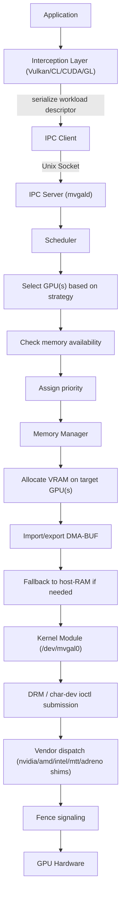

# MVGAL Design Document

> **Implementation status:** Source metadata is 0.7.16. The source changelog documents through 0.7.16. Treat design/API descriptions as available only where the relevant code path and runtime capability are verified; unsupported kernel submission and VRAM allocation return `-EOPNOTSUPP`.

**Source version:** 0.7.16 | **Last Updated:** September 2026

---

## Design Goals

1. **Transparent multi-vendor GPU aggregation** — applications see one logical GPU regardless of how many physical GPUs exist.
2. **Zero application changes** — interception via Vulkan layer, OpenCL ICD, CUDA shim, and LD_PRELOAD.
3. **Vendor-agnostic scheduling** — AMD, NVIDIA, Intel, and Moore Threads GPUs work together.
4. **Safety-first** — kernel module with DRM registration, Rust safety crates for critical paths.
5. **Low overhead** — target <2% frame time regression for single-GPU pass-through mode.

---

## Architecture Decisions

### Decision 1: Kernel Module as DRM Meta-Driver

**Chosen approach:** A Linux kernel module (`mvgal.ko`) that registers a DRM device and exposes a character device, `/dev/mvgal0`.

There are **two distinct ioctl namespaces**, and they are easy to confuse:

| Namespace | Count | Notes |
|---|---|---|
| DRM render ioctls (`mvgal_ioctls[]`, `kernel/mvgal_core.c`) | 10 | `MVGAL_QUERY_DEVICES`, `QUERY_CAPABILITIES`, `SUBMIT_WORKLOAD`, `ALLOC_MEMORY`, `FREE_MEMORY`, `IMPORT_DMABUF`, `EXPORT_DMABUF`, `WAIT_FENCE`, `SIGNAL_FENCE`, `SET_GPU_AFFINITY` — all `DRM_RENDER_ALLOW` |
| Character-device UAPI (`MVGAL_IOC_*`, magic `'M'`, `include/mvgal/mvgal_uapi.h`) | 13 declared, **9 implemented** | Implemented: `QUERY_VERSION`, `GET_GPU_COUNT`, `GET_GPU_INFO`, `GET_CAPS`, `RESCAN`, `GET_STATS`, `ENABLE`, `DISABLE`, `NTSYNC_QUERY`. Declared but **not yet handled** — `EXPORT_DMABUF`, `IMPORT_DMABUF`, `ALLOC_CROSS_VENDOR`, `FREE_CROSS_VENDOR` — fall through to `default: return -EINVAL` |

The device registers with `driver_features = DRIVER_RENDER | DRIVER_HAVE_IRQ | DRIVER_GEM` and major/minor `0.2`. Registration is deliberately minimal and logical-only: GPU discovery happens in userspace.

**Alternatives considered:**
- **Userspace-only daemon:** Simpler to develop, no kernel patching required. Rejected because DMA-BUF zero-copy and cross-device synchronization require kernel-level buffer management.
- **Upstream DRM proposal:** Would integrate natively with the DRM subsystem. Deferred because upstream review cycle is 6-12 months and vendor driver compatibility is uncertain.
- **eBPF-based approach:** Modern, safe, no module loading. Rejected because eBPF programs cannot manage GPU memory or synchronize across vendors at the required latency.

**Tradeoffs:**
- (+) Full control over buffer management and scheduling
- (+) DMA-BUF import/export across vendors
- (-) Requires module signing and MOK enrollment for Secure Boot
- (-) Must track kernel API changes across releases

### Decision 2: C++20 Daemon with IPC over Unix Socket

**Chosen approach:** `mvgald` is a C++20 daemon communicating with clients via Unix socket (`/run/mvgal/mvgal.sock`) using a binary protocol and peer-credential authentication.

The wire header is `ipc_message_header_t` (packed): `magic`, `version`, `message_type`, `payload_size`, `request_id`. The magic is **`MVGAL_IPC_MAGIC 0x4D564741`** ("MVGA") and the protocol version is `1`. Message types are the eleven `mvgal_ipc_message_type_t` values from `MVGAL_IPC_MSG_PING` (0) through `MVGAL_IPC_MSG_ERROR` (10).

> Note: `MVGAL_NET_MAGIC 0x4D56474E` ("MVGN") is a *different* constant, used by the network-pooling protocol in `mvgal_network.h`. The local IPC socket does not use it.

Authentication reads the peer's credentials with `getsockopt(SOL_SOCKET, SO_PEERCRED)` and admits root, the daemon's own uid, and members of the `mvgal` group (falling back to the daemon's primary group). The standard `video` group is also accepted, and the client's supplementary groups are read from `/proc/<pid>/status` — `getgroups()` would return the *daemon's* groups, not the client's, so it is deliberately not used.

**Alternatives considered:**
- **D-Bus as primary IPC:** Simpler, well-supported. Rejected because D-Bus adds ~50μs per message round-trip; GPU workload submission needs sub-10μs latency.
- **Shared memory ring buffer:** Lowest latency. Rejected because it requires mmap setup per client and complicates authentication.
- **gRPC/Protobuf:** Cross-language, schema-defined. Rejected because it adds ~100KB binary dependency and serialization overhead.

**Tradeoffs:**
- (+) Low latency (~2-5μs per IPC call)
- (+) Native Unix credential verification
- (-) Custom binary protocol requires versioning discipline
- (-) No automatic cross-language binding generation

### Decision 3: LD_PRELOAD Interception for All APIs

**Chosen approach:** Transparent interception via Vulkan implicit layer, OpenCL ICD wrapper, CUDA function hooking (40+ functions), and LD_PRELOAD for OpenGL/D3D/Metal/WebGPU.

**Alternatives considered:**
- **Library wrapping (link-time):** Compile against MVGAL lib instead of vendor lib. Rejected because it requires recompilation and breaks binary compatibility.
- **ptrace-based interception:** No library modification needed. Rejected because ptrace has severe performance penalties and breaks anti-cheat.
- **Binary patching:** Modify vendor libraries in-place. Rejected because it violates vendor licenses and breaks with updates.

**Tradeoffs:**
- (+) Zero application changes
- (+) Works with any binary (Steam games, AI frameworks)
- (-) Environment variable setup required per-launch
- (-) Anti-cheat software may flag LD_PRELOAD

### Decision 4: DMA-BUF Zero-Copy with Host-RAM Fallback

**Chosen approach:** Three-tier memory transfer: (1) DMA-BUF zero-copy between GPUs sharing the same IOMMU group, (2) PCIe P2P for GPUs on the same root complex, (3) host-RAM staging as universal fallback.

**Alternatives considered:**
- **CUDA peer-to-peer only:** Works for NVIDIA+NVIDIA. Rejected because MVGAL must handle AMD+NVIDIA+Intel combinations.
- **ROCm hipMemcpyPeer:** AMD-specific. Rejected for the same reason.
- **Always host-staged:** Simplest implementation. Rejected because it adds 2-5ms latency per cross-GPU transfer for large buffers.

**Tradeoffs:**
- (+) Best-case performance with zero-copy
- (+) Universal fallback ensures correctness
- (-) Complex fallback logic with three code paths
- (-) DMA-BUF support varies by driver version

### Decision 5: Rust for Safety-Critical Subsystems

**Chosen approach:** Three Rust crates with C FFI exports for use by the C++ daemon.

The directory names and the Cargo package names differ, which is an easy thing to get wrong:

| Directory | Cargo package |
|---|---|
| `safe/fence_manager/` | `mvgal_fence` |
| `safe/memory_safety/` | `mvgal_memory_safety` |
| `safe/capability_model/` | `mvgal_capability` |

`runtime/safe/lib.rs` re-exports them as modules (`fence_manager`, `memory_safety`, `capability_model`), and `safe/ffi_tests/tests/ffi_integration.rs` imports them under the same aliases — which is why the module names and the package names can appear to conflict. `pub struct GpuCapability` is defined at `safe/capability_model/src/lib.rs:37`. A fourth crate, `safe/ffi_tests`, exercises the FFI boundary.

**Alternatives considered:**
- **All C++ with RAII:** Would keep the codebase single-language. Rejected because Rust's ownership model eliminates entire classes of bugs (use-after-free, data races) that are critical in GPU synchronization code.
- **All Rust:** Would maximize safety. Rejected because the kernel module must be C (Linux requirement) and the existing IPC/scheduler code is mature C++.
- **Valgrind/ASan in CI:** Runtime detection. Rejected as insufficient alone — static analysis via Rust borrow checker is strictly better for prevention.

**Tradeoffs:**
- (+) Memory safety without garbage collection
- (+) Compile-time enforcement of concurrency safety
- (-) FFI boundary adds complexity
- (-) Two build systems (Cargo + CMake)

### Decision 6: 13 Scheduling Strategies

**Chosen approach:** The C enum `mvgal_distribution_strategy_t` (`include/mvgal/mvgal_types.h:69-84`) has **13 members** — twelve auto-numbered `0..11` plus `CUSTOM = 100`:

`ROUND_ROBIN` 0 · `AFR` 1 · `SFR` 2 · `AUTO` 3 · `COMPUTE_OFFLOAD` 4 · `HYBRID` 5 · `SINGLE_GPU` 6 · `TASK` 7 · `AI_DRIVEN` 8 · `RLD` 9 · `REP` 10 · `PPL` 11 · `CUSTOM` 100

Auto-detect (`AUTO`) selects a strategy based on workload type.

Three different strategy vocabularies exist in the tree, and they are **not** the same list:

| Where | Count | Which |
|---|---|---|
| `mvgal_types.h` (C enum) | 13 | The authoritative set, including `AI_DRIVEN`, `RLD`, `REP`, `PPL` |
| `config/mvgal.conf` comment | 9 | The commonly-used subset |
| `config/mvgal-pkexec-helper.sh:571` | 11 | What `--set-strategy` will actually accept, including the `single`/`compute` aliases |

Set the strategy with `mvgal_set_strategy()` (`mvgal.h:197`) or the scheduler-specific `mvgal_scheduler_set_strategy()` (`mvgal_scheduler.h:324`) — these are two distinct APIs, not duplicates.

**Alternatives considered:**
- **Fixed single strategy:** Simplest. Rejected because different workloads benefit from different strategies (AFR for gaming, compute offload for AI).
- **User-configured only:** No auto-detect. Rejected because most users won't know which strategy is best.
- **ML-based adaptive:** Uses the AI scheduling mode. Deferred because it requires training data and adds model loading overhead.

**Tradeoffs:**
- (+) Covers all common use cases
- (+) Auto-detect reduces user configuration burden
- (-) 13 strategies increase code surface area
- (-) Auto-detect heuristics may be wrong for edge cases

---

## Data Flow

---

## Security Model

- **Socket permissions:** `/run/mvgal/mvgal.sock` is mode `0660`, owned `root:mvgal` — falling back to the daemon's primary group if the `mvgal` group does not exist. The run directory `/run/mvgal` is chowned to the same gid and made `0775`. *(Changed in v0.7.14; earlier releases chmod'ed the socket `0660` without a matching chown, leaving it `root:root` and unreachable by any non-root user. Both the C++ and the legacy C daemon now apply this, and `mvgal-compat` reports the socket's real uid:gid and mode instead of advising you to join a group that did not own it.)*
- **IPC authentication:** `SO_PEERCRED` on the Unix socket. Admitted: root, the daemon's own uid, and members of the `mvgal` group (falling back to the daemon's primary group) or of the standard `video` group, including via supplementary group membership.
- **Kernel module:** Signed at install time; MOK enrollment required for Secure Boot. The signing keypair lives in `/var/lib/mvgal/keys/` (directory `0700`, private key `0600`) and `sign-file` is installed to `/usr/lib/mvgal/sign-file`.
- **Device nodes:** `/dev/mvgal*` is `root:video`, mode `0660`. Two mechanisms set this: `config/99-mvgal.rules` (`SUBSYSTEM=="mvgal", MODE="0666", GROUP="video"`) establishes the group, and the privileged helper then `chown root:video` + `chmod 660` each node after loading the modules. The helper deliberately does **not** leave the nodes world-writable.
- **pkexec:** All privileged operations go through `/usr/lib/mvgal/mvgal-pkexec-helper.sh`, and the daemon start is a separate `/usr/sbin/mvgald` action. `data/com.mvgal.policy` defines exactly these two actions, both `auth_admin`, and both with `exec.allow_gui=false`. *(v0.7.14 replaced ten orphaned action IDs — none of which was ever annotated on an executable, so polkit fell back to its anonymous `org.freedesktop.policykit.exec` prompt — with the two that match reality.)*
- **No firmware flashing:** Vendor-overriding firmware operations are explicitly excluded

---

## Performance Characteristics

> **These figures are design targets, not measurements.** The project publishes no benchmark data backing them, and the same numbers were carried forward across earlier revisions without being re-measured. Treat the "Notes" column as the intent of the design; the absolute values are unverified.

| Path | Latency (target) | Notes |
|------|------------------|-------|
| Single-GPU pass-through | <2% overhead | No cross-GPU transfer needed |
| DMA-BUF zero-copy | ~5-10μs | Kernel-level buffer mapping |
| PCIe P2P transfer | ~50-200μs | Depends on buffer size and PCIe gen |
| Host-RAM staging | ~2-5ms | CPU copy bottleneck |
| IPC round-trip | ~2-5μs | Unix socket with binary protocol |
| Scheduler decision | ~1-10μs | Priority queue with 16 levels |

The only figures in this document that are backed by code inspection are structural — the ioctl counts, the strategy count, and the protocol constants. Everything measured is currently aspirational.

---

## Limitations and Known Issues

1. **No direct upstream kernel integration** — the module must be built and signed per-kernel.
2. **Anti-cheat compatibility** — LD_PRELOAD interception may be flagged by kernel-level anti-cheat (EAC, BattlEye).
3. **Network GPU pooling** — exploratory design only; not a verified production execution path.
4. **AI scheduling** — the ML-based scheduler requires training data and is not yet deployed. The `AI_DRIVEN` strategy exists in the enum, but no trained model ships, and the `ai_scheduler.model_path` setting in the config file is validated with `stat()` at load time: a path that does not exist yields a diagnostic and a `NULL` model, not a crash.
5. **Collective communication** — the AllReduce/AllGather/Broadcast library is a stub; no UCX/UCC integration.
6. **Four char-device ioctls are declared but unimplemented** — `EXPORT_DMABUF`, `IMPORT_DMABUF`, `ALLOC_CROSS_VENDOR`, and `FREE_CROSS_VENDOR` are defined in the UAPI header and return `-EINVAL` from the dispatcher. They are reserved for future DMA-BUF and cross-vendor work.
7. **VRAM allocation and compute submission are not functional** — as of v0.7.12 these paths return `-EOPNOTSUPP`. See [MEMORY](MEMORY.md) for what that means for the memory architecture, and [STATUS](STATUS.md) for the capability matrix.
8. **Steam runtime behaviour is unverified on hardware** — the frame pacer's vsync wait and the Steam compatdata paths have not been observed on a multi-GPU machine. Everything in [STEAM_INTEGRATION](STEAM_INTEGRATION.md) is either read from source or explicitly marked unverified.
