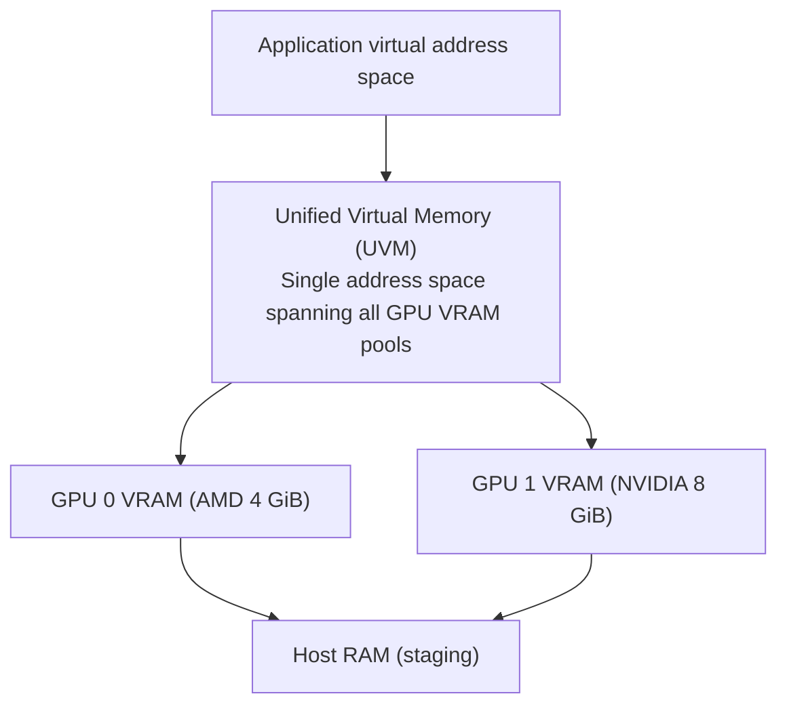
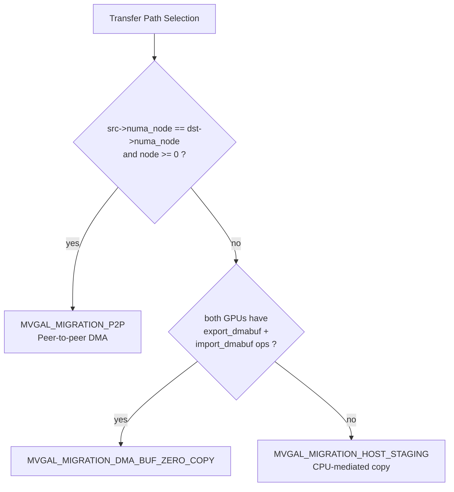
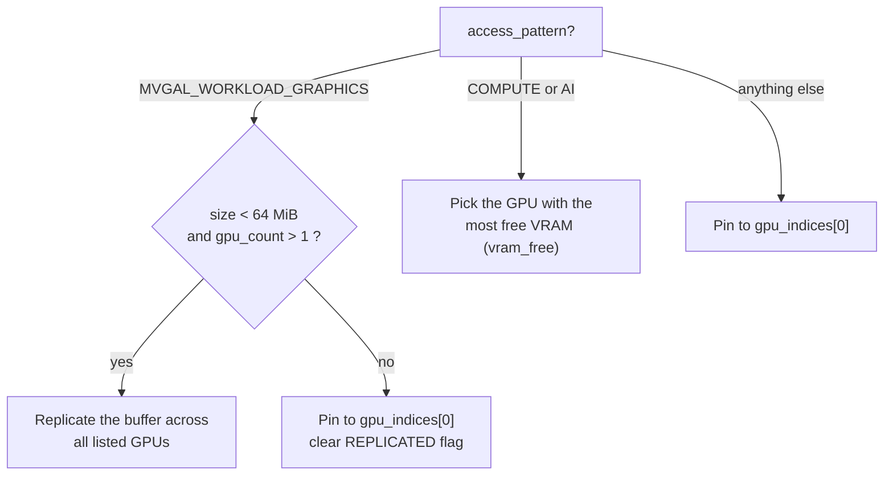

# MVGAL Memory Management

> **Implementation status:** Source metadata is 0.7.14. The source changelog documents through 0.7.14. Treat design/API descriptions as available only where the relevant code path and runtime capability are verified; unsupported kernel submission and VRAM allocation return `-EOPNOTSUPP`.

**Source version:** 0.7.14 | **Updated:** September 2026

---

> [!warning] Read this before the API below
> The public memory API in `include/mvgal/mvgal_memory.h` is **fully declared and largely implemented**, but several subsystems it describes cannot succeed on present-day hardware. Two facts dominate:
>
> 1. **Vendor VRAM allocation is not wired up.** Every vendor shim's `alloc_vram` returns `-EOPNOTSUPP` (`kernel/vendors/mvgal_nvidia.c:338`, `mvgal_amd*`, `mvgal_intel.c:368`, `mvgal_mtt.c:333`, `mvgal_adreno.h:6`). The kernel allocation path at `kernel/mvgal_memory.c:246` calls it only when `mvgal_gpu_can(gpu, MVGAL_CAP_KERNEL_VRAM)`, and on failure it silently marks the buffer `populated = false` and continues. So allocations succeed as *objects* but are not resident in any GPU's VRAM.
> 2. **Compute-submission paths are disabled.** Kernel CS submission returns `-EOPNOTSUPP` on the same vendor ops.
>
> Consequently, **Memory Mirroring**, **Predictive Prefetching**, **LRU Eviction**, and **NUMA-aware host staging** describe interfaces and intent, not working behaviour. Each section below says so explicitly. What *is* working: the userspace buffer bookkeeping, the reference-counted Rust safety layer, DMA-BUF export/import plumbing, the statistics counters, and the placement *decision* functions.

---

## Overview

MVGAL implements a unified memory manager that abstracts over physically separate GPU VRAM pools. Applications see a single virtual address space; MVGAL handles placement, migration, and synchronization transparently.

---

## Memory Architecture



> [!note]
> This diagram is the **design target**. The `mvgal_unified_heap_t` view that backs it is real and populated by `mvgal_memory_get_unified_heap()` (`include/mvgal/mvgal_memory.h:609`), which aggregates system RAM as region `[0]` and per-GPU VRAM as regions `[1..N]`. However, the per-GPU `free_bytes` figures it reports are bookkeeping values, not probed vendor VRAM.

---

## Transfer Path Selection

MVGAL selects a transfer path automatically. **There are two implementations of the same function name, and they disagree** — both are reproduced below so you know which one you are calling.

### Kernel side — `kernel/mvgal_memory.c:1460-1497`

Returns `mvgal_migration_method_t` (`kernel/mvgal_memory.h:65-67`):

```c
typedef enum {
    MVGAL_MIGRATION_DMA_BUF_ZERO_COPY = 0,  /* Direct DMA-BUF sharing */
    MVGAL_MIGRATION_P2P = 1,                /* Peer-to-peer DMA */
    MVGAL_MIGRATION_HOST_STAGING = 2,       /* CPU-mediated copy */
} mvgal_migration_method_t;
```



Note the ordering: **P2P is tried before DMA-BUF**, and the gate is NUMA-node equality — not a per-vendor compatibility table. (The source comment above this block says "same PCI root complex"; the code compares `numa_node`. Same intent, but the test is the NUMA node.)

### Userspace side — `src/userspace/memory/memory.c:963-996`

Returns the richer `mvgal_memory_copy_method_t` (`include/mvgal/mvgal_types.h`):

| Condition | Result |
|---|---|
| `src_gpu == dst_gpu` | `MVGAL_MEMORY_COPY_P2P` (no transfer needed) |
| `mvgal_p2p_cross_vendor_supported()` | delegates to `mvgal_p2p_get_optimal_method()` |
| Same PCIe root, **same vendor** | `MVGAL_MEMORY_COPY_P2P` (native P2P) |
| Same PCIe root, **cross-vendor** | `MVGAL_MEMORY_COPY_DMA_BUF` |
| Different root complexes | `MVGAL_MEMORY_COPY_CPU` |

This one *does* use vendor identity and PCIe topology rather than NUMA node.

> [!important] `size` is ignored
> Both functions take a `size_t size` parameter and both **explicitly discard it** — `src/userspace/memory/memory.c:965` reads `(void)size; /* Size not used in simplified implementation */`. There is no small-transfer vs. large-transfer threshold anywhere in the path-selection code.

### Bandwidth

The following figures are **order-of-magnitude reference values for PCIe 4.0 x16, not measurements produced by this project.** MVGAL ships no benchmark that measures any of these paths end-to-end.

| Path | Typical ceiling |
|------|-----------------|
| GPU-local VRAM | 400–900 GB/s |
| DMA-BUF zero-copy | 20–30 GB/s |
| PCIe P2P | 12–16 GB/s |
| Host-RAM staging | 6–12 GB/s |

---

## Memory Flags

`mvgal_memory_flags_t` — `include/mvgal/mvgal_memory.h:68-81`. **Twelve members**, not eleven: the previous revision of this document omitted `MVGAL_MEMORY_FLAG_NONE`.

| Flag | Value | Description |
|------|-------|-------------|
| `MVGAL_MEMORY_FLAG_NONE` | `0` | No special flags |
| `MVGAL_MEMORY_FLAG_HOST_VALID` | `1<<0` | CPU can access (mapped) |
| `MVGAL_MEMORY_FLAG_GPU_VALID` | `1<<1` | GPUs can access |
| `MVGAL_MEMORY_FLAG_CPU_CACHED` | `1<<2` | CPU cached memory |
| `MVGAL_MEMORY_FLAG_CPU_UNCACHED` | `1<<3` | Write-combined, uncached |
| `MVGAL_MEMORY_FLAG_SHARED` | `1<<4` | Shared across GPUs |
| `MVGAL_MEMORY_FLAG_DMA_BUF` | `1<<5` | Use DMA-BUF |
| `MVGAL_MEMORY_FLAG_P2P` | `1<<6` | Enable P2P transfers |
| `MVGAL_MEMORY_FLAG_REPLICATED` | `1<<7` | Replicate across GPUs |
| `MVGAL_MEMORY_FLAG_PERSISTENT` | `1<<8` | Persistent mapping |
| `MVGAL_MEMORY_FLAG_LAZY_ALLOCATE` | `1<<9` | Lazy allocation |
| `MVGAL_MEMORY_FLAG_ZERO_INITIALIZED` | `1<<10` | Zero-initialized |

---

## Allocation Policy

Placement is decided by `mvgal_buffer_optimize_placement()` (`src/userspace/memory/memory.c:1002-1058`), which branches on the workload type:



```c
mvgal_error_t mvgal_buffer_optimize_placement(
    struct mvgal_buffer *buffer,
    mvgal_workload_type_t access_pattern,
    uint32_t gpu_count,
    const uint32_t *gpu_indices
);
```

> [!note] What changed
> The previous revision of this document described a 64 MB threshold that sent *small* buffers to the GPU with the most free VRAM and *large* buffers to the "GPU that will write first". That is inverted. The 64 MB threshold applies to **graphics** workloads and selects between **replicate and pin**; the most-free-VRAM choice applies to **compute/AI** workloads.

The kernel allocation path (`kernel/mvgal_memory.c:230-260`) is separate and simpler: a `gpu_mask` of `0` means *all* GPUs, and each selected GPU gets `ops->alloc_vram()` if it advertises `MVGAL_CAP_KERNEL_VRAM`, otherwise a DMA-BUF-export fallback. It makes no free-VRAM or size-based choice.

---

## Memory Sharing Modes

`mvgal_memory_sharing_mode_t` — **five** members, `include/mvgal/mvgal_types.h:188-194` (duplicated in `include/mvgal/mvgal_intercept.h:134-138`).

| Mode | Value | Description |
|------|-------|-------------|
| `MVGAL_MEMORY_SHARING_NONE` | `0` | No sharing |
| `MVGAL_MEMORY_SHARING_EXCLUSIVE` | `1` | Single-owner access |
| `MVGAL_MEMORY_SHARING_CONCURRENT` | `2` | Concurrent access permitted |
| `MVGAL_MEMORY_SHARING_CROSS_VENDOR` | `3` | Shared across different vendors |
| `MVGAL_MEMORY_SHARING_DMA_BUF` | `4` | Shared via DMA-BUF |

> [!warning] Two fabricated modes removed
> The previous revision listed `MVGAL_MEMORY_SHARING_P2P` and `MVGAL_MEMORY_SHARING_HOST`. **Neither symbol exists anywhere in the source tree.** P2P and host staging are *transfer paths* selected by `mvgal_memory_get_placement_strategy()`, not sharing modes.

---

## Memory Mirroring

Replicating a buffer across GPUs is a real API:

```c
mvgal_error_t mvgal_memory_replicate(
    mvgal_buffer_t buffer,
    uint32_t gpu_count,
    const uint32_t *gpu_indices,
    mvgal_fence_t fence
);
```

> [!warning] No mirror controller
> The previous revision of this document claimed a "mirror controller" that "tracks access patterns per allocation and applies hysteresis" against a mirror threshold, and showed `mvgal_memory_replicate(buffer, 0x3)` with a bitmask. **No such controller exists** — there is no hysteresis logic, no mirror-threshold configuration, and no per-frame access-pattern tracking in the tree. The real signature takes an explicit GPU-index array, not a bitmask.

The only caller is the graphics branch of `mvgal_buffer_optimize_placement()` (see above), which replicates when `size < 64 MiB` and `gpu_count > 1`.

---

## Predictive Prefetching

> [!danger] Not implemented
> There is no predictive prefetcher. No code inspects per-buffer access history across frames to speculatively move a buffer ahead of the next frame. The two nearest things in the tree are:
>
> - `MVGAL_MIGRATION_PRIORITY_LOW = 3` — an enum value documented as `/**< Prefetch / speculative */` (`include/mvgal/mvgal_memory.h:654`). It is a priority label for `mvgal_memory_migrate_schedule()`; nothing schedules speculative work at it automatically.
> - `mvgal_execution_submit()` (`include/mvgal/mvgal_execution.h:169`) is a real entry point and does read the execution plan's selected-GPU mask — but it selects a GPU, it does not prefetch memory.

---

## DMA-BUF Integration

This is one of the memory subsystems that **is** genuinely wired up.

### Export / Import (userspace API)

```c
mvgal_error_t mvgal_memory_export_dmabuf(mvgal_buffer_t buffer, int *fd);
mvgal_error_t mvgal_memory_import_dmabuf(void *context, int fd, mvgal_buffer_t *buffer);
```

> [!note] Signature correction
> The previous revision showed `mvgal_memory_import_dmabuf(ctx, fd, size, &buffer)`. There is no `size` parameter — the size is carried inside the DMA-BUF object itself.

### Kernel path

`kernel/mvgal_memory.c` implements a real DMA-BUF provider:

- `mvgal_dmabuf_ops` (`kernel/mvgal_memory.c:402-407`) with `map_dma_buf`, `unmap_dma_buf`, `release`, and `mmap`.
- Export goes through `dma_buf_export(&exp_info)` at `kernel/mvgal_memory.c:461`, and the DRM ioctl `MVGAL_EXPORT_DMABUF` (`kernel/mvgal_core.c:107`) drives it.
- Bounce pages are allocated on demand during `map_dma_buf` and recycled by `mvgal_free_bounce_pages()`.
- `mmap` deliberately returns `-ENODEV` (not `-EOPNOTSUPP`), with the comment explaining that the bounce buffer is not persistently mappable, whereas `-EOPNOTSUPP` would wrongly imply the ops are missing.

> [!warning] `DRM_IOCTL_PRIME_*` is not what MVGAL uses
> The previous revision stated that "the kernel module uses `DRM_IOCTL_PRIME_HANDLE_TO_FD` and `DRM_IOCTL_PRIME_FD_TO_HANDLE` to export/import DMA-BUF objects between vendor DRM drivers." **Those two ioctls appear nowhere in the source** — only in Markdown. MVGAL calls each vendor driver's own `ops->export_dmabuf` / `ops->import_dmabuf` and wraps the result in its own `dma_buf_ops`.

---

## Rust Memory Safety Layer

The crate directory is `safe/memory_safety/`, but the **Cargo package name is `mvgal_memory_safety`**, and it is re-exported from `runtime/safe/lib.rs` as the module `memory_safety`.

```rust
// Real signatures (safe/memory_safety/src/lib.rs:158-211)
pub extern "C" fn mvgal_mem_track(size_bytes: u64, placement: u32, gpu_index: u32) -> MvgalAllocHandle;
pub extern "C" fn mvgal_mem_retain(handle: MvgalAllocHandle) -> i32;
pub extern "C" fn mvgal_mem_release(handle: MvgalAllocHandle) -> i32;
pub extern "C" fn mvgal_mem_set_dmabuf(handle: MvgalAllocHandle, fd: i32) -> i32;
pub extern "C" fn mvgal_mem_size(handle: MvgalAllocHandle) -> u64;
pub extern "C" fn mvgal_mem_placement(handle: MvgalAllocHandle) -> i32;  // -1 if invalid
pub extern "C" fn mvgal_mem_total_system_bytes() -> u64;
pub extern "C" fn mvgal_mem_total_gpu_bytes() -> u64;
pub extern "C" fn mvgal_mem_get_last_error() -> i32;
```

Placements (`safe/memory_safety/src/lib.rs:15-17`): `SystemRam = 0`, `GpuVram = 1`, `Mirrored = 2`.

> [!note] Corrections
> - `mvgal_mem_track` takes a **third** `gpu_index: u32` argument that the previous revision omitted.
> - Every fallible call returns `i32` (0 on success, negative on error), not `void`. Each crate exposes `*_get_last_error()` for the detail.
> - All externs are `#[no_mangle] extern "C"` and wrapped in `panic::catch_unwind`, so no Rust panic can unwind across the FFI boundary.
> - The FFI integration tests import the crates under their directory names — `use mvgal_fence as fence_manager;` — which is why the module and package names differ.

---

## Memory Statistics

```c
// Real signature (include/mvgal/mvgal_memory.h:482-487)
mvgal_error_t mvgal_memory_get_stats(
    mvgal_buffer_t buffer,
    uint64_t *bytes_read,        // out
    uint64_t *bytes_written,     // out
    uint64_t *gpu_access_count   // out: SUM across all GPUs
);
```

Implementation at `src/userspace/memory/memory.c:940-953` reads the buffer's atomic counters and sums `access_count[]` across all `MVGAL_MAX_GPUS` entries into the third out-parameter.

> [!warning] Signature correction
> The previous revision showed an `mvgal_memory_stats_t` struct passed by pointer with eight named fields (`total_allocated_bytes`, `dmabuf_count`, `p2p_transfers`, `staging_transfers`, …). **No such type exists** and the real function has three scalar out-parameters. A separate, genuinely-existing struct is `mvgal_migration_stats_t` (`mvgal_memory_migrate_query_stats()`), which reports `total_scheduled` / `total_completed` / `total_failed` / `total_cancelled` / `queue_depth` / `bytes_migrated`.

---

## NUMA Awareness

> [!note] What the code actually does
> The previous revision claimed MVGAL "reads the NUMA node for each GPU from `/sys/bus/pci/devices/<slot>/numa_node`" and "prefers memory on the NUMA node closest to the GPU" when allocating host staging buffers.
>
> - The value comes from the kernel API `dev_to_node(&pdev->dev)` at `kernel/mvgal_device.c:532`, not from parsing sysfs.
> - It is used for exactly three things: transfer-path selection (`kernel/mvgal_memory.c:1485`, same-node → P2P), a warning when a GPU pair straddles NUMA nodes (`kernel/mvgal_device.c:676-679`), and exposure through `MVGAL_IOC_GET_GPU_INFO` and `mvgal-info --json`.
> - **No host-staging buffer is placed on a NUMA node.** There is no node-local allocation policy in the tree.

---

## Eviction Policy

> [!danger] No LRU eviction exists
> The previous revision documented a three-step LRU procedure (scan by last-access time → evict least-recently-used to host RAM → re-populate on demand) and claimed `MVGAL_MEMORY_FLAG_PERSISTENT` buffers are never evicted. **There is no LRU list, no eviction pass, and no re-population path in the source tree.** The only eviction-related identifier is the enum value `MVGAL_EXECUTION_MIGRATION_EVICT = 3` in `include/mvgal/mvgal_execution.h:35`.

What does happen on GPU idleness is much simpler — `mvgal_check_idle_state()` (`src/userspace/core/mvgal.c:252-266`):

```c
if (mvgal_gpus[i].active && mvgal_gpus[i].memory_used == 0) {
    mvgal_log("info", "GPU %d is idle. Clock gating enabled.", i);
    mvgal_gpus[i].active = false;
} else if (!mvgal_gpus[i].active && mvgal_gpus[i].memory_used > 0) {
    mvgal_log("info", "GPU %d waking up on demand.", i);
    mvgal_gpus[i].active = true;
}
```

It toggles a logical `active` flag based on `memory_used`. It does not move or free any memory.

---

## Configuration

In `/etc/mvgal/mvgal.conf` — all of these keys exist and are read by the config loader:

```ini
[core]
# Enable cross-GPU memory migration
enable_memory_migration = true

# Enable DMA-BUF sharing
enable_dmabuf = true

# Statistics collection interval (seconds)
stats_interval = 1

[gpu_0]
# Per-GPU memory limit in MB (0 = unlimited)
memory_limit_mb = 0

[dri]
# DRM/DRI devices to enumerate
device_pattern = /dev/dri/card*

# Enable PRIME support
enable_prime = true
```

> [!note]
> The per-GPU memory limit is a **logical budget applied by the userspace allocator**. It cannot cause the kernel to free vendor VRAM, because no vendor `alloc_vram` currently succeeds (see the warning at the top of this page).

---

## Documentation Corrections in This Revision

| Claim in the previous revision | Reality in the source |
|---|---|
| 11 `MVGAL_MEMORY_FLAG_*` members | **12** — `MVGAL_MEMORY_FLAG_NONE` was missing (`mvgal_memory.h:68-81`) |
| 4 sharing modes, incl. `..._P2P` and `..._HOST` | **5** members; `..._P2P` and `..._HOST` **do not exist** (`mvgal_types.h:188-194`) |
| Small buffers → most free VRAM; large → "GPU that writes first" | Graphics + `< 64 MiB` → **replicate**; graphics otherwise → **pin to `gpu_indices[0]`**; compute/AI → **most free VRAM** (`src/userspace/memory/memory.c:1002`) |
| Mirror controller with hysteresis and a threshold | No such controller; `mvgal_memory_replicate()` takes an index array, not a bitmask |
| Predictive prefetching driven by `mvgal_execution_submit()` | Not implemented; only a `PREFETCH / speculative` priority label exists |
| `mvgal_memory_import_dmabuf(ctx, fd, size, &buffer)` | No `size` parameter (`mvgal_memory.h:358`) |
| Kernel uses `DRM_IOCTL_PRIME_HANDLE_TO_FD` / `..._FD_TO_HANDLE` | Those ioctls appear only in Markdown; MVGAL uses vendor `ops->export_dmabuf` + its own `mvgal_dmabuf_ops` |
| `mvgal_mem_track(size, placement)` | Takes a third `gpu_index: u32`; all fallible calls return `i32` |
| `mvgal_memory_get_stats(ctx, &stats)` with an 8-field struct | Three scalar out-parameters: `bytes_read`, `bytes_written`, `gpu_access_count` (`mvgal_memory.h:482`) |
| NUMA read from sysfs, used for host staging placement | Read via `dev_to_node()`; used for path selection, a cross-NUMA warning, and reporting only |
| Three-step LRU eviction; `PERSISTENT` never evicted | No LRU or eviction exists; idle handling only toggles a logical `active` flag |
| "Measured bandwidth" table | Order-of-magnitude PCIe reference values, not project measurements |
| Transfer path order: DMA-BUF → P2P → host | Kernel path tries **P2P first** (gated on NUMA-node equality), then DMA-BUF, then host staging |
| `size` parameter on path selection | Explicitly discarded in both implementations |
