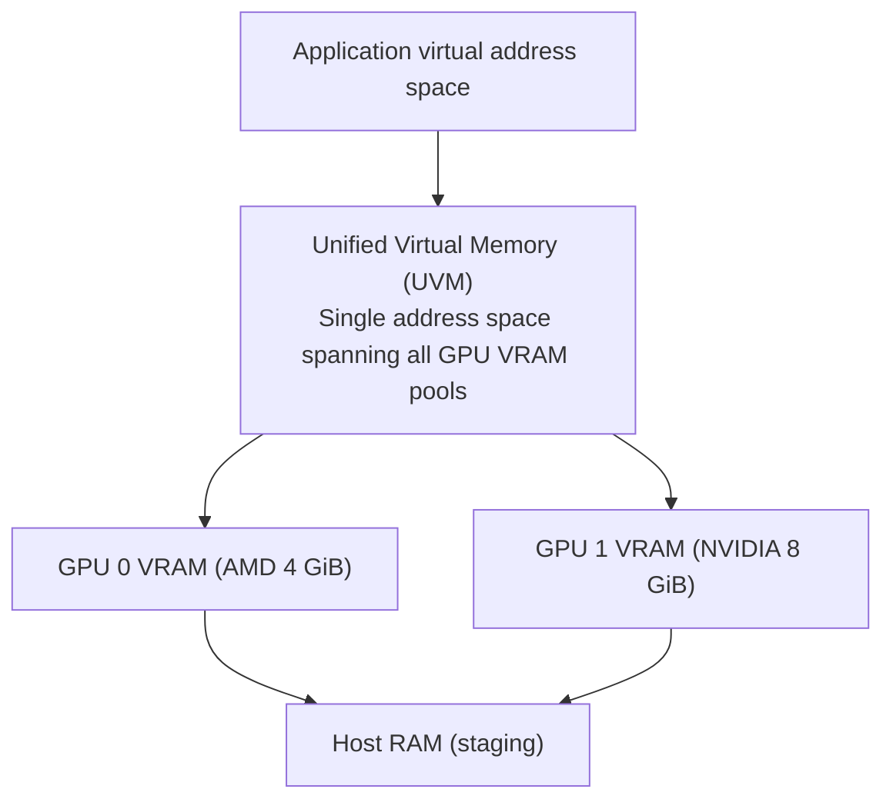
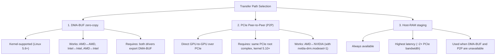
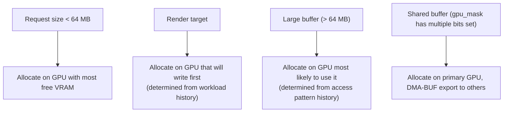

# MVGAL Memory Management

> **Implementation status:** Source metadata is 0.7.13. The source changelog documents through 0.7.12. Treat design/API descriptions as available only where the relevant code path and runtime capability are verified; unsupported kernel submission and VRAM allocation return `-EOPNOTSUPP`.

**Source version:** 0.7.13 | **Updated:** September 2026

---

## Overview

MVGAL implements a unified memory manager that abstracts over physically separate GPU VRAM pools. Applications see a single virtual address space; MVGAL handles placement, migration, and synchronization transparently.

---

## Memory Architecture



---

## Transfer Path Selection

MVGAL selects the optimal transfer path automatically:



### Measured bandwidth (typical PCIe 4.0 x16)

| Path | Bandwidth |
|------|-----------|
| GPU-local VRAM | 400–900 GB/s |
| DMA-BUF zero-copy | 20–30 GB/s |
| PCIe P2P | 12–16 GB/s |
| Host-RAM staging | 6–12 GB/s |

---

## Memory Flags

| Flag | Value | Description |
|------|-------|-------------|
| `MVGAL_MEMORY_FLAG_HOST_VALID` | `1<<0` | CPU can access (mapped) |
| `MVGAL_MEMORY_FLAG_GPU_VALID` | `1<<1` | GPUs can access |
| `MVGAL_MEMORY_FLAG_CPU_CACHED` | `1<<2` | CPU cached memory |
| `MVGAL_MEMORY_FLAG_CPU_UNCACHED` | `1<<3` | Write-combined, uncached |
| `MVGAL_MEMORY_FLAG_SHARED` | `1<<4` | Shared across GPUs |
| `MVGAL_MEMORY_FLAG_DMA_BUF` | `1<<5` | Use DMA-BUF for sharing |
| `MVGAL_MEMORY_FLAG_P2P` | `1<<6` | Enable PCIe P2P transfers |
| `MVGAL_MEMORY_FLAG_REPLICATED` | `1<<7` | Mirror on all GPUs |
| `MVGAL_MEMORY_FLAG_PERSISTENT` | `1<<8` | Persistent CPU mapping |
| `MVGAL_MEMORY_FLAG_LAZY_ALLOCATE` | `1<<9` | Defer physical allocation |
| `MVGAL_MEMORY_FLAG_ZERO_INITIALIZED` | `1<<10` | Zero on allocation |

---

## Allocation Policy



---

## Memory Sharing Modes

| Mode | Description |
|------|-------------|
| `MVGAL_MEMORY_SHARING_NONE` | GPU-local only |
| `MVGAL_MEMORY_SHARING_DMABUF` | DMA-BUF export/import |
| `MVGAL_MEMORY_SHARING_P2P` | PCIe peer-to-peer |
| `MVGAL_MEMORY_SHARING_HOST` | Host-RAM staging |

---

## Memory Mirroring

Read-only allocations accessed by multiple GPUs can be replicated to each GPU's local VRAM:

```c
// Replicate buffer to GPU 0 and GPU 1
mvgal_memory_replicate(buffer, 0x3);  // gpu_mask = 0b11
```

The mirror controller tracks access patterns per allocation and applies hysteresis to avoid thrashing. A buffer is mirrored when:
- It is accessed by ≥2 GPUs in the same frame
- The access count exceeds the mirror threshold (configurable)
- Sufficient VRAM is available on all target GPUs

---

## Predictive Prefetching

MVGAL tracks per-buffer access patterns across frames. When a buffer is consistently accessed by GPU N in frame F, MVGAL prefetches it to GPU N before frame F+1 begins.

Prefetch is triggered by `mvgal_execution_submit()` based on the execution plan's `selected_gpu_mask`.

---

## DMA-BUF Integration

### Export

```c
int fd;
mvgal_memory_export_dmabuf(buffer, &fd);
// fd is a DMA-BUF file descriptor
// Pass to another process or GPU driver
```

### Import

```c
mvgal_buffer_t buffer;
mvgal_memory_import_dmabuf(ctx, fd, size, &buffer);
```

### Kernel-level (via mvgal.ko)

The kernel module uses `DRM_IOCTL_PRIME_HANDLE_TO_FD` and `DRM_IOCTL_PRIME_FD_TO_HANDLE` to export/import DMA-BUF objects between vendor DRM drivers.

---

## Rust Memory Safety Layer

The `memory_safety` Rust crate tracks all allocations with reference counting:

```
mvgal_mem_track(size, placement)  →  handle
mvgal_mem_retain(handle)          →  increment refcount
mvgal_mem_release(handle)         →  decrement; free at 0
mvgal_mem_set_dmabuf(handle, fd)  →  associate DMA-BUF fd
```

Placements: `SystemRam=0`, `GpuVram=1`, `Mirrored=2`

Statistics:
```c
uint64_t mvgal_mem_total_system_bytes(void);
uint64_t mvgal_mem_total_gpu_bytes(void);
```

---

## Memory Statistics

```c
mvgal_memory_stats_t stats;
mvgal_memory_get_stats(ctx, &stats);

// stats.total_allocated_bytes
// stats.total_gpu_bytes
// stats.total_system_bytes
// stats.dmabuf_count
// stats.p2p_transfers
// stats.staging_transfers
// stats.bytes_transferred
```

---

## NUMA-Aware Allocation

MVGAL reads the NUMA node for each GPU from `/sys/bus/pci/devices/<slot>/numa_node`. When allocating host-side staging buffers, it prefers memory on the NUMA node closest to the GPU that will use it.

---

## Eviction Policy

When GPU VRAM is full:
1. Scan allocations sorted by last-access time (LRU)
2. Evict least-recently-used allocations to host RAM
3. Re-populate on next access (demand paging)

Allocations with `MVGAL_MEMORY_FLAG_PERSISTENT` are never evicted.

---

## Configuration

In `/etc/mvgal/mvgal.conf`:

```ini
[core]
# Enable cross-GPU memory migration
enable_memory_migration = true

# Enable DMA-BUF sharing
enable_dmabuf = true

# Statistics collection interval (seconds)
stats_interval = 1

[gpu_0]
# Per-GPU memory limit in MB (0 = unlimited)
memory_limit_mb = 0

[dri]
# DRM/DRI devices to enumerate
device_pattern = /dev/dri/card*

# Enable PRIME support
enable_prime = true
```
