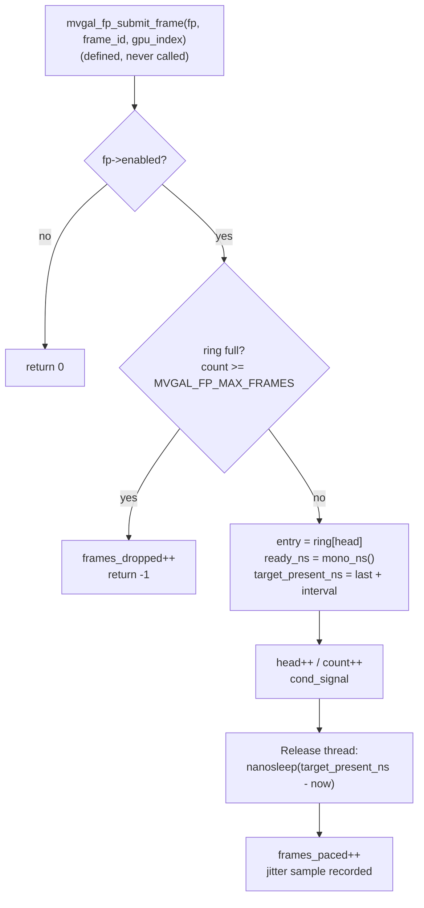

# MVGAL Steam/Proton Integration

> [!warning] Read this before the sections below
> Two facts about the current tree govern almost everything on this page:
>
> 1. **The Vulkan interception layer is real and installed. The frame pacer is not connected to anything.** `mvgal_fp_create()` is called once at daemon start and a metrics callback is attached, but **no code in the tree ever calls `mvgal_fp_submit_frame()`**. The pacer maintains statistics; it does not pace any frames.
> 2. **`compat/steam/` and `compat/wow64/` are not built.** Neither directory has a `CMakeLists.txt`, so the top-level `add_subdirectory(compat)` is skipped. The Proton plugin and the WoW64 thunk layer in those directories are dormant source.

**Source version:** 0.7.14
**Date:** September 2026

---

## Table of Contents

1. [Overview](#1-overview)
2. [Integration Methods](#2-integration-methods)
3. [Vulkan Layer Integration](#3-vulkan-layer-integration)
4. [Frame Pacer](#4-frame-pacer)
5. [Alternate Frame Rendering (AFR)](#5-alternate-frame-rendering-afr)
6. [NTSYNC](#6-ntsync)
7. [WoW64 Support](#7-wow64-support)
8. [Configuration](#8-configuration)
9. [Troubleshooting](#9-troubleshooting)
10. [Known Limitations](#10-known-limitations)
11. [Performance Tips](#11-performance-tips)
12. [Future Improvements](#12-future-improvements)
13. [Documentation Corrections in This Revision](#13-documentation-corrections-in-this-revision)

---

## 1. Overview

MVGAL's Steam and Proton integration consists of four pieces. Their status differs sharply:

| Component | Location | Status |
|-----------|----------|--------|
| **Vulkan implicit layer** | `src/userspace/intercept/vulkan/`, installed as `/usr/share/vulkan/implicit_layer.d/VK_LAYER_MVGAL.json` | **Working.** Intercepts 38 Vulkan entry points. |
| **Steam launch-option writer** | `tools/mvgal-steam-setup.c`, installed as `/usr/bin/mvgal-steam-setup` | **Working.** Edits Steam's `appinfo.vdf` `LaunchOptions`. |
| **Per-game profiles** | `runtime/daemon/steam_profile_loader.cpp`, reads `/etc/mvgal/steam_profiles/*.conf` | **Working.** Loaded by the daemon. |
| **Frame pacer** | `steam/mvgal_frame_pacer.c` | **Built but inert** — see [§4](#4-frame-pacer). |
| **Proton plugin** | `compat/steam/mvgal_proton.cpp` | **Not built** (no `compat/CMakeLists.txt`). |
| **WoW64 thunk layer** | `compat/wow64/wow64_thunk.c` | **Not built.** A different file, `src/userspace/win32/wow64_thunk.c`, *is* built. |
| **Steam compatibility tool** | `steam/toolmanifest.vdf`, `steam/compatibilitytool.vdf` | **Not installed by any package.** |

---

## 2. Integration Methods

### 2.1 Steam Launch Options

The canonical form is built by `mvgal_execution_prepare_profile()` in `src/userspace/execution/execution.c:879`:

```bash
MVGAL_ENABLED=1 MVGAL_VULKAN_ENABLE=1 MVGAL_STRATEGY=afr MVGAL_GPUS=0x3 MVGAL_LOW_LATENCY=0 %command%
```

For manual use in Steam's *Properties → Launch Options*, the reliable subset is:

```bash
ENABLE_MVGAL=1 MVGAL_VULKAN_ENABLE=1 MVGAL_STRATEGY=afr %command%
```

> [!note] Not every variable the daemon emits is consumed
> `MVGAL_ENABLED`, `MVGAL_GPUS`, `MVGAL_LOW_LATENCY`, `MVGAL_STEAM_MODE` and `MVGAL_PROTON_MODE` are all written into the child environment by `execution.c:857-881`, but a search for `getenv()` across the tree finds **no reader** for `MVGAL_GPUS`, `MVGAL_LOW_LATENCY`, `MVGAL_STEAM_MODE` or `MVGAL_PROTON_MODE`. `ENABLE_MVGAL` and `MVGAL_STRATEGY` *are* read (`compat/steam/mvgal_proton.cpp:89`, and the strategy path in the execution and interception layers).

### 2.2 Steam Compatibility Tool

> [!danger] Not packaged
> The `steam/` directory ships VDF manifests that would let Steam list MVGAL as a selectable compatibility tool, but **no RPM, deb or flatpak installs them** and nothing copies `mvgal_steam_compat.sh` into place. The only Steam-facing tooling that is actually installed is `mvgal-steam-setup` (see [§8.1](#81-steam-launch-option-writer)).

To register the tool manually, copy the directory into Steam's compatibility-tools location and restart Steam:

```bash
cp -r steam/ ~/.steam/root/compatibilitytools.d/mvgal/
```

The tool manifest is KeyValues, not JSON:

```text
"manifest"
{
    "commandline"    "/mvgal_steam_compat.sh %verb%"
    "use_sessions"   "1"
}
```

`steam/compatibilitytool.vdf` registers the tool and sets the environment Steam injects:

```text
"MVGAL-0.2.2"
{
    "install_path"  "."
    "display_name"  "MVGAL 0.2.2 (Multi-Vendor GPU Aggregation)"
    "from_oslist"   "linux"
    "to_oslist"     "linux"
    "environment"
    {
        "WINEDLLOVERRIDES"  "mvgal_wow64=n,b"
        "PROTON_NO_ESYNC"   "1"
        "PROTON_NO_FSYNC"   "1"
        "WINE_NTSYNC"       "1"
        "MVGAL_NTSYNC_ENABLE" "1"
    }
}
```

> [!warning] Two problems with the shipped VDFs
> - The tool ID and display name still say **0.2.2**, and the tree is at 0.7.14.
> - `MVGAL_NTSYNC_ENABLE` is set here but **no code reads it**. The NTSYNC userspace library in `compat/ntsync/ntsync.c` does not consult any environment variable; it opens `/dev/mvgal_ntsync` directly.

### 2.3 Environment Variables

Variables with a real consumer:

| Variable | Values | Consumed by | Mechanism | Description |
|----------|--------|-------------|-----------|-------------|
| `MVGAL_VULKAN_ENABLE` | `1` | **Vulkan loader** | manifest `enable_environment` | Activate the interception layer |
| `MVGAL_VULKAN_DISABLE` | `1` | **Vulkan loader** | manifest `disable_environment` | Force the layer off for a launch |
| `ENABLE_MVGAL` | `0` / `1` | `compat/steam/mvgal_proton.cpp:89` | `getenv()` | Master enable for a Proton launch |
| `MVGAL_VULKAN_DEBUG` | `0` / `1` | `src/userspace/intercept/vulkan/vk_layer.c:131` | `getenv()` | Layer debug logging |
| `MVGAL_STRATEGY` | see [§5.3](#53-strategy-names) | execution and interception layers | Scheduling strategy |
| `MVGAL_FRAME_PACING_DEBUG` | any | `steam/mvgal_frame_pacer.c:156` | `getenv()` | Frame-pacer trace output |
| `MVGAL_DAEMON_SOCK` | path | daemon/IPC | `getenv()` | Override the control socket path |
| `MVGAL_SOCKET_PATH` | path | daemon/IPC | `getenv()` | Override the control socket path |
| `MVGAL_RUN_DIR` | path | daemon | `getenv()` | Override the run directory |
| `MVGAL_NO_DAEMON` | any | daemon | `getenv()` | Run without the privileged daemon |
| `MVGAL_FORCE_AVAILABLE` | any | daemon | `getenv()` | Treat GPUs as present regardless of probe |
| `MVGAL_D3D_ENABLED` | `0` / `1` | Direct3D interop | `getenv()` | Enable the D3D wrapper |
| `MVGAL_ICD_DEBUG` | any | Vulkan ICD | `getenv()` | ICD debug logging |
| `MVGAL_ICD_TIMEOUT_MS` | ms | Vulkan ICD | `getenv()` | ICD probe timeout |
| `MVGAL_AMD_LLVM_PATH` | path | AMD interop | `getenv()` | Override the LLVM path |
| `MVGAL_CUDA_MIGRATE` | any | CUDA interop | `getenv()` | Force migration behaviour |
| `MVGAL_CUDA_DEBUG` | any | CUDA interop | `getenv()` | CUDA interop debug logging |
| `MVGAL_ROOT` | path | build tooling | `getenv()` | Repository root |
| `MVGAL_BUILD_DIR` | path | build tooling | `getenv()` | Build directory |
| `MVGAL_{CUDA,HIP,ROCR,SYCL,NVML,METAL,PPL,VAAPI}_{ENABLED,STRATEGY,DEBUG}` | varies | per-vendor interop | `getenv()` | Per-API-family control |

> [!note] The layer toggle is the loader's, not MVGAL's
> `MVGAL_VULKAN_ENABLE` and `MVGAL_VULKAN_DISABLE` never appear in a `getenv()` call in MVGAL's own code. They are honoured by the **Vulkan loader**, which reads the `enable_environment` and `disable_environment` blocks of the layer manifest (`manifest.json.in:13-18`). `execution.c:858,879` writes them into the child environment; the loader is what acts on them.

> [!warning] Removed in this revision
> The previous version of this page listed `MVGAL_GPU_MASK` and `MVGAL_LOG_PATH`. **Neither is read anywhere.** A `getenv()` search returns zero hits for both. `MVGAL_GPU_MASK` is *exported* by `steam/mvgal_steam_compat.sh` and appears in `steam/README.md`, but nothing consumes it. The GPU list is carried by `MVGAL_GPUS`, which `execution.c` emits but — as noted above — also nothing reads yet.

---

## 3. Vulkan Layer Integration

### 3.1 Layer Discovery

MVGAL ships a global implicit layer. The manifest is generated from `src/userspace/intercept/vulkan/manifest.json.in` and installed to `/usr/share/vulkan/implicit_layer.d/VK_LAYER_MVGAL.json`:

```json
{
    "file_format_version": "1.0.0",
    "layer": {
        "name": "VK_LAYER_MVGAL",
        "type": "GLOBAL",
        "library_path": "libVK_LAYER_MVGAL.so",
        "api_version": "1.4.0",
        "implementation_version": 2,
        "description": "MVGAL Vulkan interception layer for multi-vendor GPU aggregation",
        "functions": {
            "vkNegotiateLoaderLayerInterfaceVersion": "..."
        },
        "enable_environment": { "MVGAL_VULKAN_ENABLE": 1 },
        "disable_environment": { "MVGAL_VULKAN_DISABLE": 1 }
    }
}
```

The layer declares `"type": "GLOBAL"` and is nonetheless installed into `implicit_layer.d/`. That is deliberate — `packaging/rpm/mvgal.spec:787-798` explains that the layer only intercepts and never stands in for a `VkPhysicalDevice`, so it does not need to be explicitly requested.

> [!info] The layer is not the ICD
> The Vulkan **ICD** is a separate artifact, installed at `/usr/share/vulkan/mvgal/mvgal_icd.json` and **opt-in**. See *Enable the Vulkan ICD (opt-in)* in [INSTALL.md](INSTALL.md).

### 3.2 Intercepted Functions

The layer defines exactly 38 entry points.

**Instance level**
`vkCreateInstance`, `vkDestroyInstance`, `vkGetInstanceProcAddr`,
`vkEnumerateInstanceExtensionProperties`, `vkEnumerateInstanceLayerProperties`,
`vkEnumerateInstanceVersion`, `vkNegotiateLoaderLayerInterfaceVersion`

**Device level**
`vkCreateDevice`, `vkDestroyDevice`, `vkGetDeviceProcAddr`,
`vkCreateCommandPool`, `vkDestroyCommandPool`,
`vkAllocateCommandBuffers`, `vkFreeCommandBuffers`,
`vkCreateFence`, `vkDestroyFence`,
`vkGetDeviceQueue`,
`vkCreateSemaphore`, `vkDestroySemaphore`,
`vkCreateShaderModule`, `vkDestroyShaderModule`

**Queue level**
`vkQueueSubmit`

**Memory level**
`vkAllocateMemory`, `vkFreeMemory`, `vkMapMemory`, `vkUnmapMemory`,
`vkBindBufferMemory`, `vkBindImageMemory`

**Physical device level**
`vkEnumeratePhysicalDevices`, `vkEnumeratePhysicalDeviceGroups`,
`vkEnumeratePhysicalDeviceGroupsKHX`,
`vkGetPhysicalDeviceProperties`, `vkGetPhysicalDeviceFeatures`,
`vkGetPhysicalDeviceFormatProperties`, `vkGetPhysicalDeviceImageFormatProperties`,
`vkGetPhysicalDeviceMemoryProperties`, `vkGetPhysicalDeviceQueueFamilyProperties`

**Extension / layer enumeration**
`vkEnumerateDeviceExtensionProperties`, `vkEnumerateDeviceLayerProperties`

> [!important] `vkQueueSubmit` is intercepted. `vkQueuePresentKHR` is not.
> `vkQueuePresentKHR`, `vkQueueSubmit2`, `vkAcquireNextImageKHR` and `vkWaitForFences` appear **nowhere** in `src/userspace/intercept/vulkan/`. Anything in this document that described a presentation-path hook was wrong. `vkQueueWaitIdle` exists only in the *ICD* (`src/userspace/vulkan_icd/icd_entry.c`), which is a different component.

### 3.3 What the Layer Does at Submit

`vkQueueSubmit` is the layer's real scheduling hook. The previous version of this page showed an implementation calling `mvgal_layer_get_context()`, `mvgal_scheduler_select_gpu()` and `mvgal_ipc_send_submit()` — **none of those symbols exist**. The real handler selects a GPU from the active strategy, records telemetry, and forwards to the next layer in the chain via the loader's dispatch table.

There is no `ctx->next_vkQueueSubmit` member: the layer resolves the next hop through the standard `loaderGetNextLayerProcAddr` mechanism.

---

## 4. Frame Pacer

### 4.1 Purpose

Multi-GPU AFR can cause microstutter if frames are delivered at uneven intervals. The frame pacer is intended to hold completed frames and release them at consistent intervals.

> [!danger] The pacer is not connected to the submission path
> `runtime/daemon/daemon.cpp:208` calls `mvgal_fp_create(60)` — a **hardcoded 60 Hz**, not a detected refresh rate. `runtime/daemon/metrics_collector.cpp:64` attaches a statistics callback. **That is the complete set of callers.** A tree-wide search for `mvgal_fp_submit_frame` finds only its definition in `steam/mvgal_frame_pacer.c:217` and its declaration in the header — no call site anywhere, including tests. No frame is ever placed in the ring buffer, so `frames_paced`, `frames_dropped` and jitter stay at zero in every live deployment.

### 4.2 Architecture



> [!note] "vsync" here is a software interval, not a hardware signal
> The target presentation time is computed as `last_present_ns + frame_interval_ns`, where `frame_interval_ns = 1000000000ULL / refresh_hz`, and the release thread waits with `nanosleep()` (`steam/mvgal_frame_pacer.c:90-96, 231-247`). There is **no `drmWaitForVBlank()` call, no DRM page-flip wait, and no presentation semaphore** anywhere in the pacer. The previous diagram's "Wait for next vsync boundary → Signal presentation semaphore" described a mechanism that was never written.

### 4.3 Configuration

```c
runtime/daemon/daemon.cpp:208
    m_frame_pacer = mvgal_fp_create(60);   /* 60 Hz, hardcoded */
```

> [!warning] `MVGAL_FRAME_PACING` is never read
> The variable is exported by `tools/mvgal-steam-setup.c:338`, suggested by `tools/mvgal-compat.c:89`, and set by `steam/mvgal_steam_compat.sh`. A `getenv("MVGAL_FRAME_PACING")` search returns **zero hits**. Setting it changes nothing today. There is also **no `MVGAL_REFRESH_HZ`** variable — `mvgal_fp_set_refresh_hz()` exists in the API but is called from nowhere.
>
> The only frame-pacing variable with a real reader is `MVGAL_FRAME_PACING_DEBUG` (`steam/mvgal_frame_pacer.c:156`).

### 4.4 Frame Pacer API

This block is correct as published and matches `steam/mvgal_frame_pacer.h` (SPDX MIT) exactly:

```c
/* Initialize frame pacer (0 selects MVGAL_FP_DEFAULT_HZ) */
mvgal_frame_pacer_t *pacer = mvgal_fp_create(144);  /* 144 Hz */

/* Submit a completed frame */
mvgal_fp_submit_frame(pacer, frame_id, gpu_index);

/* Get statistics */
uint64_t frames_paced, frames_dropped;
double avg_jitter_us;
mvgal_fp_get_stats(pacer, &frames_paced, &frames_dropped, &avg_jitter_us);
```

The full surface also includes `mvgal_fp_destroy()`, `mvgal_fp_set_refresh_hz()` and `mvgal_fp_set_stats_callback()`.

---

## 5. Alternate Frame Rendering (AFR)

### 5.1 How AFR Works with MVGAL

```
Frame 0: GPU 0 renders
Frame 1: GPU 1 renders
Frame 2: GPU 0 renders
Frame 3: GPU 1 renders
...
```

`afr` is strategy value `1` in `mvgal_distribution_strategy_t` (`include/mvgal/mvgal_types.h:70`).

### 5.2 Frame Synchronization

> [!warning] There is no MVGAL AFR coordinator in this tree
> The previous version of this section showed a `struct afr_sync` and an `afr_submit_frame()` function. **Neither exists.** `steam/README.md` lists a file `steam/mvgal_afr.c`; that file is not present. The 38 intercepted Vulkan entry points include `vkQueueSubmit` but no present-path or per-frame-acquire hook, so the layer has no place to sequence alternating frames today.

What the layer *can* do at `vkQueueSubmit` is choose which GPU receives the work, according to the active strategy. That is the whole of the implemented AFR behaviour.

### 5.3 Strategy Names

`afr` is one of **three different strategy vocabularies** in this project, and they do not agree:

| Source | Count | Values |
|--------|-------|--------|
| `include/mvgal/mvgal_types.h:69-84` (C enum) | 13 | `round_robin`, `afr`, `sfr`, `auto`, `compute_offload`, `hybrid`, `single_gpu`, `task`, `ai_driven`, `rld`, `rep`, `ppl`, `custom` |
| `config/mvgal.conf` comment (`[core] default_strategy`) | 9 | a subset of the above |
| `config/mvgal-pkexec-helper.sh:571` | 11 | `single`, `single_gpu`, `hybrid`, `task`, `afr`, `sfr`, `compute`, `compute_offload`, `round_robin`, `auto`, `custom` |

> [!caution] The C enum's `single_gpu` is not accepted by the privileged helper's `single` alias set, and the helper additionally accepts `compute`, which the C enum calls `compute_offload`. Use the **C enum names** in configuration; use the helper only for the operations it implements.

### 5.4 AFR Configuration

`[afr]` in `config/mvgal.conf` has exactly two keys:

```ini
# /etc/mvgal/mvgal.conf
[afr]
enable_sync = true
sync_timeout_ms = 16
```

> [!warning] `max_latency` does not exist
> The previous version of this page listed `max_latency = 3`. A tree-wide search finds zero occurrences. It was removed. The `max_latency_ms` key that appears in `steam/steam_profiles/baldurs_gate3.conf` is read by the daemon-side profile loader, not by `config/mvgal.conf` — see [§8.2](#82-per-game-profiles).

---

## 6. NTSYNC

### 6.1 What NTSYNC Is

NTSYNC is a Wine synchronization mechanism that maps Windows NT kernel objects — events, semaphores, mutexes, timers, fences — onto Linux primitives. Games built for Windows assume it exists, and produce wrong behaviour or refuse to start without it.

### 6.2 MVGAL's NTSYNC Implementation

This is real and it is kernel-side, not the pseudo-code the previous version of this page showed.

**Kernel module** `kernel/mvgal_ntsync.c` registers a character device at **`/dev/mvgal_ntsync`**. It defines 15 ioctls under magic `'N'`:

| Range | Ioctls |
|-------|--------|
| Object lifecycle | `CREATE_EVENT` (1), `OPEN_EVENT` (2), `CREATE_SEMAPHORE` (5), `CREATE_MUTEX` (8), `CREATE_TIMER` (11), `CREATE_FENCE` (13) |
| Waiting | `WAIT_EVENT` (3), `WAIT_SEMAPHORE` (6), `ACQUIRE_MUTEX` (9), `WAIT_FENCE` (14) |
| Signalling | `SIGNAL_EVENT` (4), `RELEASE_SEMAPHORE` (7), `RELEASE_MUTEX` (10), `SET_TIMER` (12), `SIGNAL_FENCE` (15) |
| Multi-wait | `WAIT_MULTI` (16) — backs `ntsync_wait_multi()` |

> [!note] The ring buffer is 8 frames deep
> `MVGAL_FP_MAX_FRAMES` is `8` and `MVGAL_FP_DEFAULT_HZ` is `60` (`steam/mvgal_frame_pacer.c:30-31`). Both are private to the `.c` file, not exported in the header. A submit into a full ring increments `frames_dropped` and returns `-1`.

> [!note] A separate ioctl namespace
> These `'N'`-magic ioctls are distinct from the `'M'`-magic `MVGAL_IOC_*` set on `/dev/mvgal0`. `MVGAL_IOC_NTSYNC_QUERY` (`_IOR('M', 0x20, struct mvgal_uapi_ntsync_info)`) is the capability query that reports whether the NTSYNC module initialised; the object operations live on the dedicated `/dev/mvgal_ntsync` node.

**Userspace library** `compat/ntsync/ntsync.c` (419 lines, MIT) wraps the ioctls. It is compiled into `libmvgal` by `src/userspace/CMakeLists.txt:104` and into the unit-test target by `src/tests/tests/unit/CMakeLists.txt:267`.

```c
/* compat/ntsync/ntsync.h */
int ntsync_init(void);                                    /* opens /dev/mvgal_ntsync */
void ntsync_fini(void);

int ntsync_create_event(int *handle, int initial_state, int auto_reset);
int ntsync_create_semaphore(int *handle, int initial_count, int max_count);
int ntsync_create_mutex(int *handle);
int ntsync_create_timer(int *handle);
int ntsync_set_timer(int handle, uint64_t due_time_ns, uint64_t period_ns);
int ntsync_create_fence(int *handle, uint32_t gpu_index);

int ntsync_wait(int handle, uint64_t timeout_ns);         /* 0 = wait forever */
int ntsync_wait_multi(const int *handles, int count, int wait_all,
                      uint64_t timeout_ns, int *index);   /* max 64 handles */

int ntsync_signal(int handle);
int ntsync_release_semaphore(int handle, int count);
int ntsync_release_mutex(int handle);
int ntsync_close(int handle);
```

`ntsync_wait_multi()` is the `WaitForMultipleObjects`-equivalent Wine expects. `ntsync_set_timer()` takes an absolute `CLOCK_MONOTONIC` due time and an optional period (`0` = one-shot).

> [!warning] The previous kernel structs were fabricated
> The old `struct mvgal_event` / `struct mvgal_semaphore` / `struct mvgal_mutex` blocks, with `wait_queue_head_t` members and a `struct task_struct *owner`, **are not MVGAL's types.** They are illustrations of the Windows concepts. The real kernel objects are `struct mvgal_ntsync_object` and friends in `kernel/mvgal_ntsync.c`. (`struct mvgal_semaphore` does exist, but in `src/userspace/memory/memory_internal.h:72` — it is a userspace interop object, unrelated to NTSYNC.)

### 6.3 Integration Points

1. **Wine / Proton** — Wine's own NTSYNC lives in `dlls/ntsync/`. That is upstream Wine's code, not MVGAL's. `steam/compatibilitytool.vdf` sets `WINE_NTSYNC=1` to enable it.
2. **MVGAL kernel module** — `mvgal_ntsync.ko` provides the `/dev/mvgal_ntsync` object model above, loaded as part of the standard module set (see [SECURE_BOOT.md](SECURE_BOOT.md)).
3. **MVGAL userspace** — `libmvgal`'s NTSYNC library wraps it for MVGAL's own synchronisation.

> [!note] The udev rule
> `config/99-mvgal.rules` sets `MODE="0666", GROUP="video"` on the `mvgal_ntsync` misc node so unprivileged Proton/Wine processes can reach it. Unlike `/dev/mvgal*`, this node is **not** tightened to `0660` by the privileged helper.

---

## 7. WoW64 Support

### 7.1 WoW64 (Windows-on-Windows 64-bit)

WoW64 allows 32-bit Windows applications to run on a 64-bit host. Under Proton this requires care with pointer widths when GPU API calls cross from 32-bit game code into 64-bit native layers.

### 7.2 What Actually Exists

Two separate things carry the WoW64 name in this tree, and only one is built.

**Built:** `src/userspace/win32/wow64_thunk.c`, compiled by `src/userspace/win32/CMakeLists.txt`.

**Not built:** `compat/wow64/wow64_thunk.c` and its header `compat/wow64/wow64.h`. `compat/` has no `CMakeLists.txt`, so the top-level `add_subdirectory(compat)` at `CMakeLists.txt:393-395` is skipped. The `compat/wow64/` API is nonetheless well-specified:

```c
/* compat/wow64/wow64.h — dormant, not compiled */
void  *wow64_alloc_shared_memory(size_t size);
void   wow64_free_shared_memory(void *ptr, size_t size);
void  *wow64_thunk_pointer(uint32_t ptr32);
uint32_t wow64_unthunk_pointer(const void *ptr);
int    wow64_init(int is_32bit);
void   wow64_fini(void);
uint64_t wow64_call_32bit(uint32_t func32, uint64_t *args, int arg_count);
int    wow64_register_thunk(uint32_t func32, const char *name);
```

`include/mvgal/mvgal_wow64.h` is a public **thunk** header defining the context classification:

```c
/* include/mvgal/mvgal_wow64.h */
MVGAL_WOW64_CONTEXT_UNKNOWN
MVGAL_WOW64_CONTEXT_GAMING
MVGAL_WOW64_CONTEXT_RENDERING
```

> [!warning] The previous code sample was broken
> The old `is_wow64_process(pid_t pid)` example declared `struct task_struct *task;` and then passed it to `is_32bit_task()` without ever assigning it. It was illustrative pseudo-code presented as source. No process-detection function like it exists in the tree.

### 7.3 WoW64 Configuration

> [!danger] These variables are not read
> `MVGAL_WOW64` and `MVGAL_WOW64_DEBUG` are exported by `steam/mvgal_steam_compat.sh` and appear in `steam/README.md`. A `getenv()` search finds **zero readers** for either. There is no supported way to toggle WoW64 handling from the environment; it is compiled in.

---

## 8. Configuration

### 8.1 Steam Launch Option Writer

`mvgal-steam-setup` **is** installed, at `/usr/bin/mvgal-steam-setup` (`packaging/rpm/mvgal.spec:739`).

```bash
mvgal-steam-setup --list                 # or -l: show detected Steam games
mvgal-steam-setup --check                # or -c: verify library discovery
mvgal-steam-setup --add 1091500          # or -a <name|appid>: configure one game
mvgal-steam-setup --add cyberpunk 2077 --strategy afr --frame-pacing
mvgal-steam-setup --add 1091500 --strategy hybrid --gpu-mask 0x3
mvgal-steam-setup --add --all            # configure every detected game
mvgal-steam-setup --auto                 # same as --add --all
mvgal-steam-setup --remove <name|appid>  # or -r
mvgal-steam-setup --help                 # or -h
```

Sub-commands are `--list/-l`, `--add/-a`, `--remove/-r`, `--check/-c`, `--auto`, `--help/-h` (`tools/mvgal-steam-setup.c:553-576`). `--add` takes a mandatory game name or App ID — there is no interactive prompt, and with no argument it errors rather than asking. The optional modifiers are `--strategy <name>`, `--frame-pacing`, `--gpu-mask <mask>` and `--all` (`mvgal-steam-setup.c:540-549`).

It scans Steam's `appmanifest_*.acf` files, and writes a `LaunchOptions` line into Steam's `appinfo.vdf` in the form `"<options> %command%"`.

It ships a built-in profile table. Each entry pairs a game name with a strategy and a note:

| Game | Strategy | Notes |
|------|----------|-------|
| cyberpunk 2077 | `afr` | Ray tracing may not scale; disable for best perf — adds `MVGAL_FRAME_PACING=1` |
| quake | `afr` | Vulkan renderer |
| cs2 | `afr` | Native Vulkan; AFR tested — adds `MVGAL_FRAME_PACING=1` |
| elden ring | `single` | Frame pacing sensitive; single GPU recommended — adds `MVGAL_FRAME_PACING=1` |
| dota 2 | `sfr` | SFR recommended for UI-heavy scenes |
| witcher 3 | `hybrid` | Hybrid works well |

> [!note] The `MVGAL_FRAME_PACING=1` this tool writes has no effect
> See [§4.3](#43-configuration).

> [!caution] It does not create a `compat_tools.d` manifest
> The previous version of this page said the tool creates `~/.local/share/Steam/steamapps/common/Proton - MVGAL/` and `~/.local/share/Steam/steamapps/compat_tools.d/mvgal.json`. **It does not.** It edits `appinfo.vdf` launch options only. A search for `compat_tools` and `VersionString` in the C sources returns nothing.

### 8.2 Per-Game Profiles

The daemon loads per-game profiles from **`/etc/mvgal/steam_profiles/`** (`runtime/daemon/steam_profile_loader.cpp:26`). The RPM creates this directory at install time (`mvgal.spec:411`) and it survives as `%dir %attr(755,root,root)` (`mvgal.spec:806`).

Each file is named after the Steam App ID and parsed as INI. Three examples ship in `steam/steam_profiles/`:

```ini
# /etc/mvgal/steam_profiles/1086940.conf
[application]
name = Baldur's Gate 3
app_id = 1086940
vendor = Larian Studios

[strategy]
primary = afr
fallback = sfr
enable_hybrid = true

[frame_pacing]
enabled = true
max_latency_ms = 16
vsync_aligned = true

[power]
profile = gaming
idle_timeout_ms = 5000
throttle_temp = 78

[gpu_selection]
primary_gpu_mask = 0x3
cross_vendor = true
```

The loader reads `app_id` from `[application]` and matches it as the executable name (`steam_profile_loader.cpp:148, 283-284`).

The other two shipped profiles are `cyberpunk2077.conf` and `halflife_alyx.conf`.

### 8.3 Compatibility Tool Manifest

> [!warning] The published JSON manifest does not exist
> The previous version of this page showed a `compat_tools.d` JSON file with `"Name"`, `"Version": "0.7.3"`, `"VersionString": "Proton 9.0 with MVGAL 0.7.3"`, `"Architectures"` and `"Priority"`. **No such file is in the tree, and MVGAL ships no Steam *runtime* manifest.** Steam's custom-runtime `compat_tools.d` format is a different thing from Steam's `compatibilitytools.d` format; MVGAL uses the latter, and its content is the KeyValues shown in [§2.2](#22-steam-compatibility-tool) — currently stamped `0.2.2`.

---

## 9. Troubleshooting

### 9.1 Common Issues

**Issue: Game shows a black screen**

```bash
# Fall back to a single GPU
MVGAL_STRATEGY=single %command%

# Or disable the layer entirely for this launch
MVGAL_VULKAN_DISABLE=1 %command%
```

**Issue: Layer not loaded**

```bash
# Is the manifest installed?
ls -l /usr/share/vulkan/implicit_layer.d/VK_LAYER_MVGAL.json

# Is the library there?
ls -l /usr/lib*/libVK_LAYER_MVGAL.so    # /usr/lib on Fedora, /usr/lib64 on RHEL

# Ask the loader directly — the canonical way to see implicit layers
VK_LOADER_DEBUG=layer,vulkaninfo 2>&1 | grep -i mvgal

# Turn on layer tracing
MVGAL_VULKAN_DEBUG=1 %command%
```

> [!tip] `vulkaninfo` will not list it
> The manifest declares `"type": "GLOBAL"`, so the layer is not enumerated as a *selectable* layer. Use `VK_LOADER_DEBUG=layer` to confirm the loader found and loaded it, rather than grepping `vulkaninfo`'s layer list.

**Issue: Anti-cheat**

```bash
# Fall back to a single GPU and disable the layer
MVGAL_STRATEGY=single MVGAL_VULKAN_DISABLE=1 %command%
```

### 9.2 Debug Commands

```bash
# Layer debug logging
export MVGAL_VULKAN_DEBUG=1

# Frame-pacer trace (this one has a real reader)
export MVGAL_FRAME_PACING_DEBUG=1

# View current state
mvgal-status              # or --watch / --once / --interval / --version / --help
mvgal-status --watch --interval 2

# Machine-readable GPU state
mvgal-info --json
mvgal-info --count
mvgal-info --vulkan-groups

# Steam integration status
mvgal-compat
mvgal-steam-setup --check
```

> [!warning] `mvgal-status --verbose` does not exist
> `tools/mvgal-status.c` accepts `--watch/-w`, `--once/-1`, `--interval/-i`, `--version/-V` and `--help/-h`. There is no `--verbose`. Similarly, `MVGAL_LOG_PATH` is not a real variable and no log file can be redirected with it.

### 9.3 Log Analysis

```bash
# Daemon log — the unit installs as mvgal-daemon.service
journalctl -u mvgal-daemon.service -f

# The unit declares Alias=mvgald.service and Alias=mvgal.service, but those
# only resolve once the unit has been enabled.
systemctl enable mvgal-daemon.service
journalctl -u mvgald.service -f

# The RPM creates /var/log/mvgal at install time (mvgal.spec:475)
ls -la /var/log/mvgal/

# Module load failures, including the Secure Boot hint
journalctl -u mvgal-daemon.service | grep -i "not loaded\|userspace-only"
```

> [!note] `/var/log/mvgal/` is created but not written to by the pacer
> The directory is created by `%install` and shipped as an empty owned directory. Nothing in the current tree writes frame-timing or GPU-assignment logs there, so `grep -i "jitter\|drop" /var/log/mvgal/mvgald.log` will find nothing. Use `journalctl` and the layer's own debug output instead.

---

## 10. Known Limitations

1. **The frame pacer is inert.** No call site for `mvgal_fp_submit_frame()` exists, and its refresh rate is hardcoded to 60 Hz. Frame pacing is not happening.
2. **AFR has no coordinator.** The layer picks a GPU for `vkQueueSubmit`, but nothing sequences alternating frames; there is no present-path interception.
3. **"Vsync" is a software interval.** The pacer computes a target time from `1e9 / refresh_hz` and waits with `nanosleep()`. It does not wait on a real display signal.
4. **Four launch variables are emitted but never read.** `MVGAL_GPUS`, `MVGAL_LOW_LATENCY`, `MVGAL_STEAM_MODE`, `MVGAL_PROTON_MODE` — set by `execution.c`, consumed by nothing.
5. **`compat/steam/` and `compat/wow64/` are not built.** The Proton plugin and the WoW64 thunk layer are dormant.
6. **The Steam compatibility tool is not packaged.** No build installs `steam/toolmanifest.vdf` or `compatibilitytool.vdf`, and both still name version `0.2.2`.
7. **Kernel-side VRAM allocation and compute-submission return `-EOPNOTSUPP`.** AF- and compute-strategy wins therefore cannot be backed by device memory today — see [MEMORY.md](MEMORY.md).
8. **Anti-cheat is not officially supported.** EasyAntiCheat and BattlEye have their own layer and overlay policies, and some titles refuse to run with an unexpected global Vulkan layer. MVGAL provides no bypass; `MVGAL_VULKAN_DISABLE=1` plus a single-GPU strategy is the only supported fallback.

---

## 11. Performance Tips

1. **Verify before you tune.** `mvgal-info --json` shows what is actually detected; `mvgal-status --watch` shows live state.
2. **Check PCIe topology.** The userspace copy path chooser picks `COPY_P2P` for same-vendor devices under one PCIe root complex, `COPY_DMA_BUF` for cross-vendor under one root, and `COPY_CPU` across roots (`src/userspace/memory/memory.c:963-996`).
3. **Watch temperatures.** The daemon exposes a `TemperatureWarning` D-Bus signal and a `PowerLimitReached` signal.
4. **Use the daemon's profile loader, not launch options**, for per-game settings — it is the path with a real consumer.

---

## 12. Future Improvements

1. **Wire up the frame pacer.** Connect `mvgal_fp_submit_frame()` to the submission path, detect the real refresh rate instead of hardcoding 60 Hz, and consider a DRM page-flip wait in place of `nanosleep()`.
2. **Build `compat/`.** Adding a `compat/CMakeLists.txt` would activate the Proton plugin and the WoW64 thunk layer.
3. **Package the compatibility tool.** Install `steam/` into `compatibilitytools.d` and bump the VDF version stamp from 0.2.2.
4. **Reconcile the strategy vocabularies.** Three lists of 13 / 11 / 9 names should become one.
5. **Implement the AFR coordinator.** A present-path or per-frame-acquire hook is needed before alternating frame rendering is real.
6. **Game-specific profiles already exist** as `steam_profiles/`; widening the shipped set is a matter of adding INI files.
7. **AI-based scheduling.** `MVGAL_AI_DRIVEN` is strategy value `8` in the enum, and the scheduler is a built-in heuristic — not a learned model. See *the `ai_scheduler` note* in [INSTALL.md](INSTALL.md).

---

## 13. Documentation Corrections in This Revision

Every claim below was in the 0.7.13 edition of this page. Each was checked against the source tree at commit `5511cf4`.

| Previous claim | Reality |
|----------------|---------|
| Layer name `VK_LAYER_MVGAL_aggregation` | `VK_LAYER_MVGAL` (`manifest.json.in`) |
| Layer `"type": "IMPLICIT"` | `"type": "GLOBAL"`, installed to `implicit_layer.d/` deliberately |
| Manifest `apis` array at API `1.3.0` | `api_version` `1.4.0`; no `apis` array |
| Manifest `chain_as_layer_as_is: true` | Not present. `functions.vkNegotiateLoaderLayerInterfaceVersion`, `enable_environment.MVGAL_VULKAN_ENABLE` and `disable_environment.MVGAL_VULKAN_DISABLE` were all missing |
| `vkQueueSubmit2` intercepted | Not intercepted. 38 real entry points; `vkQueueSubmit` only |
| `vkQueueWaitIdle` intercepted by the layer | It exists only in the ICD |
| `vkGetDeviceQueue2` intercepted | Not intercepted |
| `mvgal_layer_get_context()`, `mvgal_scheduler_select_gpu()`, `mvgal_ipc_send_submit()`, `ctx->next_vkQueueSubmit` | **None exist.** Layer uses the standard loader dispatch chain |
| `vkQueuePresentKHR` → `mvgal_frame_pacer_submit(...)` | `vkQueuePresentKHR` is not intercepted; the function is `mvgal_fp_submit_frame()` and has no caller |
| "Wait for next vsync boundary / Signal presentation semaphore" | Software interval plus `nanosleep()`. No hardware vsync, no presentation semaphore |
| `MVGAL_REFRESH_HZ` | Does not exist. `mvgal_fp_create(60)` is hardcoded |
| `MVGAL_FRAME_PACING` toggles pacing | Never read by any component |
| `MVGAL_GPU_MASK` | Never read. `steam/mvgal_steam_compat.sh` exports it; nothing consumes it |
| `MVGAL_LOG_PATH` | Does not exist |
| `MVGAL_WOW64`, `MVGAL_WOW64_DEBUG` | Never read. `compat/wow64/` is not compiled |
| `struct afr_sync`, `afr_submit_frame()` | Do not exist. No AFR coordinator in the tree |
| `[afr] max_latency = 3` | Does not exist. `[afr]` has `enable_sync` and `sync_timeout_ms` only |
| Kernel `struct mvgal_event` / `mvgal_semaphore` / `mvgal_mutex` for NTSYNC | Not MVGAL's types. Real objects are `struct mvgal_ntsync_object` in `kernel/mvgal_ntsync.c` on `/dev/mvgal_ntsync` |
| "MVGAL Kernel: NTSYNC syscall translation layer" | Replaced with the real 15-ioctl device and its userspace wrapper |
| `is_wow64_process()` with an unassigned `task_struct *` | Broken pseudo-code. No such function exists |
| `mvgal-steam-setup` creates `compat_tools.d/mvgal.json` | It edits Steam `appinfo.vdf` `LaunchOptions` only |
| `compat_tools.d` JSON manifest, version `0.7.3` | No such file. MVGAL ships KeyValues, stamped `0.2.2` |
| `mvgal-status --verbose` | Does not exist. Use `--watch` / `--once` / `--interval` |
| `/var/log/mvgal/mvgald.log` | Directory is created at install time but nothing writes to it |
| "EAC and BattlEye **block** Vulkan layers" | Overstated. Softened to a supported-fallback statement |
| `VK_KHX_multivendor` as a planned extension | Never part of this project |
| Table of Contents listing 9 sections | The document has 12 |
| "Afr is one of 4 strategies" | One of 13 in the C enum; three disagreeing vocabularies exist |
